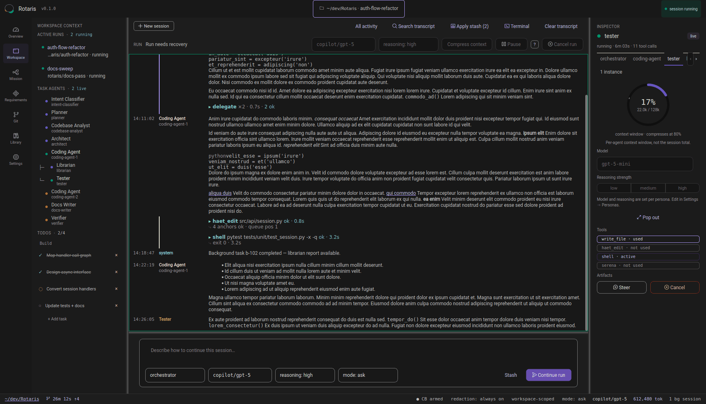
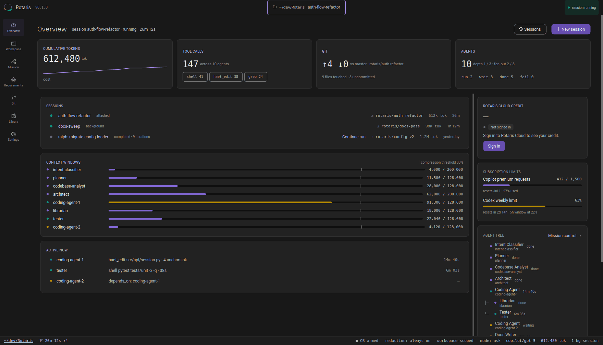
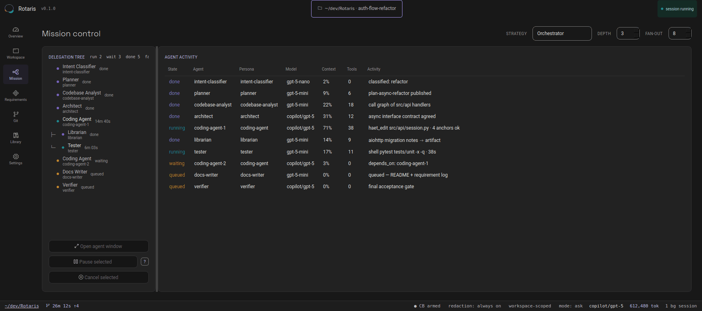

<div align="center">


# Rotaris

### Beyond the terminal. Into the era of agentic software development.

Agentic coding has outgrown the command line.<br>
Rotaris gives multi-agent development the interface it deserves.

[](https://github.com/Concrete-Dynamics/Rotaris/releases/latest)
[](https://github.com/Concrete-Dynamics/Rotaris/actions/workflows/release.yml)
[](https://github.com/Concrete-Dynamics/Rotaris/actions/workflows/reqtocode.yml)
[](LICENSE)
[](https://www.python.org/downloads/)

**[Download](https://rotaris.ai)** · [Quick start](#quick-start) · [How it works](#how-it-works) · [The interface](#six-views-one-workspace) · [Documentation](docs/INDEX.md) · [rotaris.ai](https://rotaris.ai)

</div>

<p align="center">
  
</p>

<div align="center">

**Free and open source. No account required — install it and point it at a repository.**

<sub>Screenshots are the shipped demo workspace: <code>uv run python -m rotaris --demo</code></sub>

</div>

---

<div align="center">

## The control plane for agentic software engineering

Rotaris turns a high-level mission into coordinated work across planning, implementation,
testing, documentation, Git, and verification. See what every agent is doing, intervene when
necessary, and review the evidence before accepting the result.

</div>

<table>
<tr>
<td width="25%" align="center" valign="top"><b>Orchestration</b><br><br><sub>Specialist agents — architect, coders, tester, verifier — coordinated as an engineering team.</sub></td>
<td width="25%" align="center" valign="top"><b>Control</b><br><br><sub>Inspect, pause, redirect, approve, or stop work at any point in the run.</sub></td>
<td width="25%" align="center" valign="top"><b>Verification</b><br><br><sub>Completion depends on requirements, tests, and explicit gates.</sub></td>
<td width="25%" align="center" valign="top"><b>Traceability</b><br><br><sub>Requirements, implementation, tests, agent actions, and artifacts remain connected.</sub></td>
</tr>
</table>

<div align="center">

*You get an inspectable software-engineering team, with every specialist visible as it works.*

</div>

---

## Quick start

### Install the desktop app

Download a build for your platform from **[rotaris.ai](https://rotaris.ai)** or from
[GitHub Releases](https://github.com/Concrete-Dynamics/Rotaris/releases/latest). The desktop
build bundles its own runtime — no Python required. Releases are built by CI from tagged
commits and published with SHA-256 checksums.

### Or run from source

Requires **Python ≥ 3.12** and [`uv`](https://docs.astral.sh/uv/) on `PATH`.

```bash
git clone https://github.com/Concrete-Dynamics/Rotaris.git
cd Rotaris
uv sync --all-packages
```

`uv sync --all-packages` installs both workspace members (`rotaris-core` and the `rotaris`
desktop app) plus their dev groups. Run every Python tool through `uv run`; do not activate
`.venv` or call binaries from it directly.

**1. Register a provider**

```bash
uv run rotaris-cli login
```

The guided flow authenticates with the provider's own OAuth flow, discovers the models your
account can reach, writes a minimal `.rotaris/agents.yaml` if none exists, and fills the
startup model slots. No API keys to paste for the OAuth providers.

**2. Launch a surface**

```bash
uv run python -m rotaris .            # desktop app against the current workspace
uv run python -m rotaris --demo       # desktop app with representative sample data
uv run rotaris-cli run                # interactive terminal UI
uv run rotaris-cli run "Add unit tests for the auth module"
uv run rotaris-headless run "Refactor the API layer" --background
```

---

## How it works

<div align="center">

### From first word to final accept

`Classify` → `Plan` → `Delegate` → `Run` → `Verify` → `Accept`

</div>

| Stage | What happens | You control |
| --- | --- | --- |
| **Say what done means** | One clear mission is all Rotaris needs. A small intent classifier reads it first and shapes the orchestration, so the run starts from your intent. | what done means |
| **A coordinator by design** | The orchestrator decomposes the mission into a todo list and hands each slice to a specialist. It plans, delegates, and verifies with its write tools held back. | pause or steer, any time |
| **The right specialist for every slice** | Analyst, architect, coding agents, tester, librarian — each persona brings its own model and tools to the slice it was built for. | model routing per role |
| **Parallel where it can, bounded where it must** | Independent slices run side by side; dependent ones wait their turn. Depth, fan-out, and iteration limits — plus a circuit breaker that catches runaway loops — keep every run in check. | approve tool calls, cancel |
| **A gate that can't be flattered** | A read-only verifier grades the result against your original request, working from the evidence your repository's own checks produced. | nothing — the gate runs itself |
| **Your signature, last** | The completion summary shows what ran, what passed, and what is still open. Read the evidence, then accept — or send it back. | the final accept |

---

## Why Rotaris

Most coding assistants run one agent with one prompt. That is fine for a single file. Once
a task spans design, implementation, tests, and docs, you need coordination — and you need
the harness to survive the failure modes that make unattended agents expensive:

- **Runaway loops.** A circuit breaker detects unproductive repetition, injects a corrective
  prompt, and escalates to termination if the agent keeps looping.
- **Premature cancellation.** Children have explicit lifecycle states and dependency
  tracking; the parent knows what is still running instead of guessing.
- **Orchestrators that do all the work.** The orchestrator is `coordinator_only` by default —
  its write tools are stripped unless the intent classifier grants direct access for a
  genuinely trivial change.
- **No visibility.** Every tool call, agent state transition, and child report is rendered
  in the UI and persisted with the session.
- **Silent "done".** A read-only `verifier` persona re-checks completed work against the
  original request before the run reports success.
- **Unbounded permissions.** A policy engine decides allow / ask / deny per tool call, and
  an unattended run in a permissive mode is downgraded rather than trusted.

---

<div align="center">

## Six views. One workspace.

Everything the harness knows — sessions, agents, requirements, worktrees, artifacts,
configuration — has one visible home. Plus **Settings** for providers, models, permission
mode, MCP servers, and runtime policy.

</div>

<table>
<tr>
<td width="33%" valign="top"><b>Overview</b><br><sub>Sessions, provider limits, token usage, and everything currently running — at a glance.</sub></td>
<td width="33%" valign="top"><b>Workspace</b><br><sub>The live transcript, the delegation tree, and the inspector — where you talk to the orchestrator.</sub></td>
<td width="33%" valign="top"><b>Mission</b><br><sub>The full task hierarchy: dependencies, per-agent models, tool counts, elapsed time, and state.</sub></td>
</tr>
<tr>
<td valign="top"><b>Requirements</b><br><sub>A kanban board over delivery states with a blocked strip, plus detail, evidence, and graph panes.</sub></td>
<td valign="top"><b>Git</b><br><sub>Worktrees, branch context, changed files, diffs, and local commits made by agents — reviewable before anything leaves the machine.</sub></td>
<td valign="top"><b>Library</b><br><sub>The prompt stash, session artifacts, and improvement proposals — the persistent knowledge a mission produces and consumes.</sub></td>
</tr>
</table>

<p align="center">
  
</p>

<div align="center"><sub><b>Overview</b> — token spend, subscription limits, context-window pressure, and what is running right now.</sub></div>

<p align="center">
  
</p>

<div align="center"><sub><b>Mission control</b> — the delegation tree and every agent's state, model, context use, and current activity.</sub></div>

---

## Supervised autonomy, fully observable

Every agent's state, tools, elapsed time, context window, and model assignment stay visible
while the run is live — and every consequential action has a human handle.

- **Pause a run**, steer an agent mid-task, change its model or reasoning strength, or cancel —
  cancellation cascades to every descendant.
- **Failures surface as visible states**, and the orchestrator re-delegates the fix with the
  failing evidence attached.
- **Context windows are metered per agent** and compress automatically at 80%.

## Agents work inside the fence

Every capability an agent has is scoped, logged, and revocable. Unsafe overrides are explicit,
and they are yours to grant.

| Boundary | What it means |
| --- | --- |
| **Workspace-scoped file access** | Agents read and write inside the selected workspace only, with path-traversal prevention. |
| **Controlled shell execution** | Shell commands run under workspace policy; consequential actions can require approval. |
| **Secret redaction** | Known secrets are redacted from transcripts, reports, and anything sent to a provider. |
| **Restricted token storage** | Provider credentials stay on your machine in `~/.local/share/rotaris/tokens/`, mode `0600`. |
| **Loop protection** | Iteration limits and circuit breaking stop runaway agents before they burn tokens. |
| **Cancellation, always** | Any run, any agent, any time — cancellation propagates through the whole delegation tree. |

**What runs where.** The application and orchestration engine run entirely on your machine;
your repository is never uploaded. Only the prompts and code context needed for a task are sent
to the model providers you configure — with local models, nothing leaves the machine. Sessions,
logs and worktrees live in `.rotaris/` inside your workspace, configuration in
`~/.config/rotaris/`.

Details: [SECURITY.md](SECURITY.md) · [Permissions and security](#permissions-and-security) ·
[docs/legal/data-flows.md](docs/legal/data-flows.md)

---

## The three surfaces

Rotaris ships as a **PySide6 desktop application** (the primary interface), a **Textual
terminal UI**, and a **headless CLI** — all three driving the same engine.

| Surface | Distribution | Import package | Entry point |
| --- | --- | --- | --- |
| Rotaris desktop (primary UI) | `rotaris` (`apps/rotaris/`) | `rotaris` | `rotaris` |
| Rotaris engine (backend) | `rotaris-core` (`src/`) | `rotaris_core` | `rotaris-cli`, `rotaris-headless` |
| Rotaris TUI (secondary UI) | part of `rotaris-core` | `rotaris_core.tui` | `rotaris-cli run` |

State lives under `<workspace>/.rotaris/`, global config under `~/.config/rotaris/`, and
credentials under `~/.local/share/rotaris/`.

Built on the [OpenHands SDK](https://github.com/All-Hands-AI/openhands-sdk).

### Desktop app

`apps/rotaris/` is a PySide6 workspace with seven views, reachable via `Ctrl+1`…`Ctrl+7`:
Overview, Workspace, Mission, Requirements, Git, Library, and Settings (also `Ctrl+,`).

Design constraints the app holds to (see [`apps/rotaris/AGENTS.md`](apps/rotaris/AGENTS.md)):
usable at `1000×680` with compact drawers, WCAG 2.2 AA contrast and accessible names on every
control, explicit ready / running / success / empty / recoverable-error / unrecoverable-error
states, and confirmation before anything destructive or permission-expanding.

**Composer slash commands** — `/stop`, `/pause`, `/compress`, `/clear`, `/new`, `/resume`,
`/search`, `/worktree`, `/stash`, `/pop`, `/model <name>`, `/persona <name>`, plus one command
per discovered skill. A suggestion popup filters as you type and marks unknown names.

**Diagnostics** — `--diagnostics [light|deep]` records an opt-in timestamped UI trace for
debugging layout and performance problems.

### Terminal UI

The Textual TUI is the secondary interface and stays feature-capable:

- Top bar with a focused-agent badge (live state + elapsed time), transcript, agent status,
  run info, and a persistent todo pane
- Command palette (`Ctrl+P`): stop run, new/continue session, edit startup models, runtime
  model selection, toggle tool events, toggle reasoning, send to background
- Runtime model picker (`Ctrl+M`) backed by live provider catalogs
- Session picker, background detach/reattach, prompt history cycling, prompt stash
- Slash commands: `/stop`, `/pause`, `/resume`, `/new`, `/mcp`, `/improvements`, `/tools`,
  `/background`, `/stash`, `/pop`, `/theme`, `/logout`, `/compress`, `/model`, `/search`,
  `/clear`, `/cancel`, `/help`, `/quit`
- Status bar showing the resolved workspace path and active git branch

Agent states rendered in both UIs: `queued`, `running`, `waiting_on_dependencies`,
`summarizing`, `succeeded`, `failed`, `cancelled`, `blocked`.

---

## Orchestration model

The orchestrator receives a goal, plans it, and delegates. What the engine provides around
that:

| Capability | Detail |
| --- | --- |
| Parallel fan-out | Independent subtasks run concurrently (`max_active_children: 6`, `max_children: 20`) |
| Background delegation | Non-blocking tasks with IDs; results retrieved on demand via `background_output` / `wait_for_tasks` |
| Dependency DAG | Explicit `depends_on` with topological scheduling and cycle detection |
| Cascading cancellation | Cancelling a parent stops every active descendant |
| Depth cap | 3 levels of delegation below the entry persona |
| Child reports | Every terminal child emits a structured JSON report artifact (summary, edited/created files, commands, test results, errors, next actions) |
| Shared artifact store | Session-scoped; sibling summaries are auto-injected so agents never start from zero |
| Failure handling | Failed dependencies move dependents to `blocked` |
| Circuit breaker | Loop detection with corrective injection, escalating to termination |
| Intent classification | A pre-flight `intent-classifier` tailors orchestrator instructions and tool grants to the task shape |
| Completion classification | After each successful iteration a small-model check decides whether the goal is actually met |
| Verifier gate | A read-only `verifier` validates finished work against the original request |
| Model fallback | If the model emits no event within `llm_response_timeout`, the persona's `fallback_model` takes over without killing the child |

### Ralph Loop

Bounded iterative autonomy for long-running work: read the plan and progress state, pick the
next incomplete task, do exactly that one, verify, update progress, repeat. Stop conditions
are all-tasks-complete, agent-declares-done, unrecoverable failure, cancellation, or the
configured iteration/time budget. Each iteration produces a report artifact; the todo list is
the progress anchor and is persisted with the session.

### Post-run improvement loop

After a run reaches a terminal state, an Improvement Collector analyses it and writes
structured improvement proposals to a workspace-scoped store — without interrupting the task.
Proposals surface in the desktop Library view and can later be executed by a separate Improver
agent with its own permission boundary. Recurring local quirks are additionally kept as
**workspace-scoped persona memory** and re-injected on future runs.

---

## Every change, traced and gated

Requirements are files in your repo with a status — draft, approved, deprecated. Code links to
them with `@traces`, tests with `@verifies`, and a check fails the build on orphan code or spec
drift.

| Requirement | → Task | → Code change | → Test | → Gate |
| --- | --- | --- | --- | --- |
| *Session handlers shall be non-blocking under load* | Convert session handlers to async · `coding-agent-1` | `src/api/session.py` | 38 passed · 0 failed | Checks green · verifier graded **PASS** |

Completion is decided by the checks that ran and the grader that read them. Every
code-changing iteration runs your own checks — lint, typecheck, tests, traceability — and a
blocking check that failed, or never ran, blocks completion. Then a read-only verifier grades
what the checks cannot see: does the work answer your request? Is the todo list true of the
code on disk? Did anything creep in?

ReqToCode enforces the requirement-to-code and requirement-to-test links by compiling the
requirement store and failing the build on orphan code or spec drift — so the trail outlives
the run. See [Requirements traceability](#requirements-traceability-reqtocode).

---

## Built-in personas

Fifteen personas ship by default. Each carries its own system prompt, model slot, toolset,
and MCP server list; all of it is overridable per workspace.

| Persona | Role | Notes |
| --- | --- | --- |
| `orchestrator` | Tech lead: decomposes, delegates, coordinates, runs the completion gate | `coordinator_only`; write tools granted only by intent policy |
| `intent-classifier` | Pre-flight: maps the raw request to an orchestration intent | No tools; small model |
| `architect` | Design, structure, interface contracts | Owns the architecture docs |
| `coding-agent` | Scoped implementation and verification | |
| `tester` | Writes and runs tests, reports coverage gaps | Playwright MCP |
| `docs-writer` | Technical documentation and requirement entries | |
| `refactorer` | Behaviour-preserving cleanup | |
| `planner` | Turns research into ordered execution plans | Can delegate and publish artifacts |
| `requirements-engineer` | Goals → traceable requirements and acceptance criteria | |
| `librarian` | **External** reference: library docs, RFCs, vendor APIs, web | Tavily MCP |
| `codebase-analyst` | **Internal** analyst: call graphs, symbol usage, diagnostics | Read-only; Serena |
| `verifier` | Final acceptance gate against the original request | Read-only; runs tests and lints |
| `ui-verifier` | Browser-driven UI verification with screenshot evidence | Read-only; Playwright MCP |
| `gatekeeper` | Reads the workspace's manifests and authors the check suite the gate runs | Read-only; runs after an iteration changes the techstack |
| `project-initializer` | First-run Serena activation and onboarding | System-only; not reachable via `delegate` |

`librarian` answers questions from **outside** the repository; `codebase-analyst` answers
questions **inside** it. The orchestrator's routing matrix picks between them.

---

## Tools

Personas declare tools by friendly name in `agents.yaml`; `agents/factory.py::TOOL_NAME_MAP`
is the authoritative mapping. MCP servers go under `mcp_servers:`, never under `tools:`.

| Tool | Description |
| --- | --- |
| `read_file` | Line-numbered reads with pagination, in-file grep, directory listing, encoding detection. Records reads in a ledger shared with `write_file`. |
| `write_file` | Create, edit, overwrite, insert, undo. Edits use a 4-level fallback cascade (exact → whitespace-normalised → indent-normalised → fuzzy). Atomic writes via `mkstemp` + `os.replace`. Requires a prior read. |
| `haet_read` / `haet_edit` | Hash-Anchored Edit Tool — opt-in editing anchored on content hashes with snapshot concurrency control. |
| `grep` / `glob` | Read-only workspace search; uses `rg` when available, no shell, no network. |
| `terminal` | Command execution rooted at the workspace, with persistent and background sessions, timeouts, and structured outcomes. |
| `git_commit` | Local commits only — no push, pull, rebase, or amend. |
| `todo` | Session-scoped task list with stable IDs and phases (`pending`, `in_progress`, `completed`, `abandoned`). |
| `fetch` | Single web page retrieval with line-range selection. |
| `artifact_read` / `artifact_list` / `artifact_write` | Session-scoped artifact store; child reports are auto-materialised. |
| `delegate` | Fan-out delegation with dependency tracking. |
| `background_output` / `wait_for_tasks` | Retrieve background task results (`summary` or `verbatim`) or block until specific tasks finish. |
| `ask_questions` | Agent asks the user a structured set of questions and blocks on the answer. |

<details>
<summary><b>HAET — hash-anchored editing</b></summary>

Standard line-number patching fails when a model reproduces surrounding context slightly
wrong, which gets worse with file size (the [Harness Problem](https://blog.can.ac)). HAET
tags each line with an xxHash32 → 2-character base62 content hash at display time; the model
references lines by anchor, edits are validated against the hash before application, and a
FIFO queue serialises concurrent edits to the same file. A stale anchor is rejected, forcing a
re-read instead of a corrupted write.

HAET remains fully supported but is **not** the default editing path — shipped personas use
the hardened `read_file` / `write_file` pair.

</details>

<details>
<summary><b>Custom Python tool plugins</b></summary>

Register your own tools as decorated Python functions: sync or async, typed arguments,
docstring used as the LLM-facing description, JSON-serialisable (or Pydantic) arguments and
return values. Declared per persona in `agents.yaml`, discovered from `tools/` directories in
either config layer, loaded at runtime, and run in-process. Duplicate tool names after config
resolution are a startup error; exceptions become structured tool errors.

</details>

---

## Permissions and security

Every tool call passes through a policy engine that returns allow, ask, or deny.

**Modes** (`runtime.permission_mode`, overridable per persona and switchable mid-session):

| Mode | Behaviour |
| --- | --- |
| `restricted` | Mutating tools denied by default; reads outside the workspace require approval |
| `ask` (default) | Mutating tools require approval; read-only tools always allowed |
| `autonomous` | Allowed inside the workspace; anything touching a path outside it still asks |

An unrecognised mode name falls back to `restricted`.

**Unattended downgrade.** A permissive mode on a host without the container sandbox is
downgraded to `ask` for any run with no interactive approval host (background, headless, TUI),
unless `runtime.allow_unsandboxed_autonomous: true` is set for that workspace. In a host with
no approval UI, an `ask` decision resolves via `runtime.headless_approval_policy` — `deny`
(refuse the call, let the agent re-plan) or `abort` (refuse and stop the run). Approvals time
out after `approval_timeout_seconds` (default 300 s).

Beyond the mode presets:

- **Command patterns** classify destructive shell invocations for the policy engine.
- **Audit log** records permission decisions per session.
- **Workspace-scoped file access** — all paths resolved to real paths; symlink escapes and
  traversal outside the workspace root are rejected. Opt out explicitly with
  `--unsafe-outside-workspace` or `shell.allow_outside_workspace: true` (the UI shows a
  persistent indicator).
- **Secret redaction** in UI, logs, transcripts, and report artifacts; `api_key` values are
  held as `SecretStr` and kept out of dumps.
- **Token storage** at `~/.local/share/rotaris/tokens/` with `0600` permissions and atomic
  writes.

---

## The right model for every role

Route each persona to a different model by capability, cost, and availability. Set defaults at
startup, override per run, and fall back automatically when a provider is unavailable.

Requests run through litellm (30+ providers: OpenAI, Anthropic, Google, Ollama, Azure, AWS
Bedrock, any OpenAI-compatible endpoint), with two provider families that authenticate
in-terminal instead of via API keys:

| Provider | Flow | Notes |
| --- | --- | --- |
| GitHub Copilot | Device Flow (RFC 8628) | One-time code confirmed at `github.com/login/device` |
| OpenAI Codex | PKCE authorization code | Browser opens `auth.openai.com`; a local callback server receives the token |
| Claude Code | Subscription runtime | Optional extra `rotaris-core[claude-code]`; requests run through the Claude Agent SDK's local runtime instead of litellm |
| DeepSeek, OpenAI-compatible, static | API key | Multiple labelled instances supported |

Stored tokens are reused and refreshed transparently on later runs. `rotaris-cli login` can be
re-run to add a provider without replacing the existing one; `rotaris-cli logout` with no
argument opens a selector listing only providers that currently hold credentials.

**Model slots.** Personas reference `small_model`, `medium_model`, `large_model`,
`default_summary_model`, and `fallback_model` rather than hard-coded model IDs, so switching
provider is a config change and not a prompt rewrite. Any persona can still pin an explicit
model ID.

- Persistent defaults: `Ctrl+P` → `Startup Models` in the TUI, or the Settings view in the
  desktop app. Both are backed by a shared catalog table merging configured models with live
  Copilot and Codex catalogs.
- Temporary per-run override: `Ctrl+M` (TUI) or `/model <name>` (desktop composer).
- Re-sync discovered models without re-authenticating: `rotaris-cli models refresh
  [--provider copilot]`. Exits non-zero if a targeted provider fails or is not eligible.
- Subscription usage and rate limits are tracked and surfaced in the Overview view.

`models.yml` remains supported for static or custom provider declarations, but ordinary
onboarding no longer needs it.

---

## MCP integration

Preconfigured servers, wired into the personas that need them:

| Server | Purpose |
| --- | --- |
| `serena` | Symbolic code intelligence — symbols, references, diagnostics, edits — and project memories (`uvx`, no install step, pinned release) |
| `playwright` | Browser automation for UI verification (headless) |
| `tavily` | Web search |
| `git` | Read-only git inspection (mutating git tools disabled) |

Additional servers are configured per persona in `agents.yaml`. A server that is unavailable
at runtime is dropped from the agent's tool list and shown as unavailable in the UI rather
than failing the run — a missing `uvx`, for example, simply removes Serena.

**Per-persona tool grants.** Carrying a server is not carrying its whole surface. A persona's
`mcp_tools:` map narrows each server to the tools its role needs, and the grant is enforced
where tools are created, so an ungranted tool is never offered to the model. The shipped
personas use it for Serena: every code-facing persona gets its lookups, only `coding-agent`,
`tester` and `refactorer` get its symbolic edits, and only `project-initializer` may write
project memories. A server with no entry keeps its whole surface.

```yaml
codebase-analyst:
  mcp_servers: [serena, git]
  mcp_tools:
    serena: [find_symbol, find_referencing_symbols, search_for_pattern]
```

**Auto-discovery** reads standard `mcp.json` files from conventional filesystem and repository
locations, so configurations are interoperable with Claude Desktop, Cursor, VS Code, Cline,
and Claude Code. npm (`@modelcontextprotocol/server-*`) and `uvx` packages are resolved
automatically. `/mcp` or the command palette opens a management screen for toggling servers
without editing files.

---

## Context injection: AGENTS.md and skills

**AGENTS.md.** Rotaris discovers `AGENTS.md` across three tiers — user-global
(`~/.config/rotaris/`), project root, and a walk up from the working directory — merges them
top-down, and injects the result as always-on workspace context at agent construction time. No
frontmatter, no triggers, just Markdown every agent sees before the first turn.

**Skills.** Portable `SKILL.md` directories are discovered from `.agents/skills/` and
`.opencode/skills/` in the project (walking up to the repository root), plus
`~/.agents/skills/`, `~/.config/opencode/skills/`, and `~/.openhands/skills/installed/`. Each
skill can be loaded off, name-only, user-invocable-only, or fully on, and can be marked
manual-only or auto-only. Name collisions resolve deterministically with the shadowed entry
recorded. Discovered skills also appear as composer slash commands.

---

## Isolated worktrees, reviewable commits

Each session works in its own Git worktree, so parallel missions never trample each other.
Agents commit locally with attributed authorship — you review diffs and decide what leaves the
machine.

Sessions persist as JSON snapshots under `<workspace>/.rotaris/sessions/<session_id>/`, with
PID-based file locking, incremental writes for crash recovery, schema versioning, and graceful
degradation on partial corruption. A snapshot holds the transcript, child-agent state history,
tool events, report artifacts, a config snapshot, and todo state. Background sessions run
without an attached UI and can be reattached later.

```bash
uv run rotaris-cli run --background --isolate "Implement the export pipeline"
uv run rotaris-cli run --background --isolate --worktree-branch feat/export "…"
uv run rotaris-cli run --background --worktree ../existing-tree "…"
```

Branches are named `rotaris/session/<id>` by default and stored under the configured
`worktree_storage_subpath` (`worktrees`). Worktree options require `--background` with a task.
The desktop Git view lists worktrees and merges session branches back.

---

## CLI reference

<details>
<summary><b><code>rotaris-cli</code> (Typer, loads the TUI)</b></summary>

```
rotaris-cli run [TASK]                Execute a task or start the interactive TUI
rotaris-cli sessions                  List available sessions
rotaris-cli version                   Show version
rotaris-cli login [PROVIDER]          Register a provider and discover models
rotaris-cli logout [PROVIDER]         Remove stored credentials (interactive if omitted)
rotaris-cli models refresh            Re-sync discovered provider models
rotaris-cli providers list|set-key|set-base-url|validate|reauth|delete
rotaris-cli secrets set|unset|unset-all|list       MCP server environment secrets
rotaris-cli config set-tavily-key                  Store the Tavily API key
```

`run` options:

| Flag | Short | Description |
| --- | --- | --- |
| `--background` | `-b` | Run headless |
| `--workspace PATH` | `-w` | Workspace root (default: CWD) |
| `--session ID` | `-s` | Continue an existing session |
| `--isolate` | | Create a dedicated git worktree for this session |
| `--worktree PATH` | | Attach the session to an existing worktree |
| `--worktree-branch NAME` | | Branch name for `--isolate` |
| `--config PATH` | `-c` | `agents.yaml` override |
| `--persona NAME` | `-p` | Override the entry persona |
| `--max-iterations N` | | Cap Ralph loop iterations |
| `--unsafe-outside-workspace` | | Allow file operations outside the workspace |
| `--logout PROVIDER` | | Sign out of a provider and exit |

</details>

<details>
<summary><b><code>rotaris-headless</code> (argparse, imports no UI libraries)</b></summary>

`run`, `sessions`, `version`, `login`, `logout`, `providers delete`. Suitable for CI,
containers, and any host where importing Textual or Qt is undesirable.

</details>

<details>
<summary><b><code>rotaris</code> (desktop)</b></summary>

```
rotaris [WORKSPACE] [--demo] [--diagnostics [light|deep]] [--diagnostics-output DIR]
```

</details>

---

## Configuration

Layered YAML with field-wise overlay merge:

```
~/.config/rotaris/               ← global, always loaded
  agents.yaml                      ← global overrides
  project_settings.yaml            ← provider/model snapshot from login + discovery
  tools/                           ← global custom tool plugins

<workspace>/.rotaris/            ← workspace layer, higher priority
  agents.yaml                      ← startup model slots + persona overrides
  models.yml                       ← optional static/custom providers
  tools/                           ← project tool plugins
  sessions/                        ← session snapshots
  improvement_artifacts/           ← post-run improvement proposals
```

Same key in both layers: only the fields you specify are overridden; the rest is inherited.
List and dict fields such as `tools` or `mcp_servers` **replace** the inherited value rather
than deep-merging.

### Minimal `agents.yaml`

```yaml
default_persona: orchestrator
default_summary_model: medium_model
small_model: copilot/gpt-5-nano
medium_model: copilot/gpt-5-mini
large_model: copilot/gpt-5
fallback_model: small_model

personas:
  codebase-analyst:
    model: medium_model
  docs-writer:
    model: large_model
```

You do not need to materialise the built-in persona catalog — unspecified personas keep their
product defaults.

<details>
<summary><b>Optional <code>models.yml</code></b></summary>

```yaml
models:
  custom-server:
    provider: openai-compatible
    model_id: google/gemma-4-26B-A4B-it
    base_url: http://example.com/v1
    api_key: key-...
```

</details>

<details>
<summary><b>Default runtime policy</b></summary>

| Setting | Default |
| --- | --- |
| Max children per parent (active / total) | 6 / 20 |
| Max delegation depth | 3 levels below the entry persona |
| Max Ralph iterations | 20 |
| Child timeout / stall timeout | 1200 s / 90 s |
| LLM response timeout (triggers `fallback_model`) | 120 s |
| Model call timeout | 120 s |
| Terminal timeout | 100 s (background: 3600 s, max 20 sessions) |
| Non-terminal tool timeout | 30 s |
| Summary agent timeout | 120 s |
| Improvement collector timeout | 60 s |
| Permission mode | `ask` |
| Headless `ask` resolution | `deny` |
| Approval timeout | 300 s |
| Automatic retries | 1 transient, 0 validation |
| Dependency failure | Dependents move to `blocked` |
| Cancellation | Cascades to active descendants |

</details>

---

## Repository layout

```
src/rotaris_core/
├── agents/         # persona registry, factory, prompts, playbooks, compressor,
│                   # circuit breaker, persona memory, AGENTS.md loader
├── orchestrator/   # ChildManager (DAG, deps, cycle detection), Scheduler,
│                   # SummaryAgent, RotarisDelegateTool
├── ralph/          # bounded iterative loop driver + iteration observers
├── improvement/    # post-run collector and improver flow
├── verifier/       # deterministic completion verifier
├── tools/          # read/write file, terminal, search, todo, fetch, artifacts,
│                   # git_commit, ask_questions, background tasks, plugin loader
├── haet/           # hash-anchored edit engine (hasher, anchor, patch, queue)
├── permissions/    # policy engine, presets, modes, approval, command patterns, audit
├── config/         # layered YAML loading, schema, validation, MCP discovery
├── providers/      # provider catalogs, discovery, runtimes, usage limits
├── auth/           # OAuth flows (Copilot device, Codex PKCE), token storage
├── models/         # model catalog and selection
├── session/        # snapshots, persistence, locking
├── skills/         # SKILL.md catalog and injection
├── init/           # first-run project initialization
├── reqtocode/      # requirement ↔ code/test traceability tooling
├── tui/            # Textual UI (screens, widgets, providers, styles)
└── cli/            # Typer CLI, headless argparse CLI, auth flow, background runner

apps/rotaris/src/rotaris/
├── models/         # framework-free UI state + observable store
├── views/          # dashboard, workspace, mission, requirements, git, library,
│                   # settings, main_window
├── widgets/        # reusable Qt primitives
├── services/       # config, git, run bridge, coordinator, worktrees, persistence
├── diagnostics/    # opt-in UI tracing
└── theme/          # design tokens, fonts, brand, and global QSS
```

**Runtime shape:**

```
Desktop         -> MainWindow -> RunCoordinator -> RunBridge -> RalphLoop
Interactive CLI -> RotarisTuiApp -> MainScreen -> TuiRunController -> TuiRalphLoop
Background CLI  -> cli/background.py -> SessionManager + RalphLoop

RalphLoop -> Scheduler -> ChildManager -> asyncio.to_thread(LocalConversation.run)
```

Single-process and asyncio-based. `LocalConversation.run()` is synchronous OpenHands SDK code,
so it runs via `asyncio.to_thread`. No server or daemon.

---

## Built in the open

Every claim on this page maps to code you can read.

Read [AGENTS.md](AGENTS.md) first — it is the canonical agent- and contributor-facing
orientation. Scoped rules live in [apps/rotaris/AGENTS.md](apps/rotaris/AGENTS.md) (desktop UI
standards) and [tests/AGENTS.md](tests/AGENTS.md) (test conventions).

### Commands

```bash
uv sync --all-packages                                   # setup
uv sync --all-packages --extra claude-code               # setup incl. Claude Agent SDK

# Tests — 7,000+ test functions across the engine and desktop suites
uv run pytest -q --timeout=120 -n auto                   # full engine suite
uv run pytest tests/unit/ tests/integration/ -n auto -q --timeout=120
uv run pytest apps/rotaris/tests -q --timeout=120 -p no:textual-snapshot -n auto -m "not serial"
uv run pytest -m capability -x -v --timeout=600          # against a real LLM (slow)
uv run pytest --cov=rotaris_core --cov-report=term-missing

# Quality gates
uv run ruff check  src/ tests/ apps/rotaris/src/ apps/rotaris/tests/ --exclude 'tests/fixtures/files/large.py'
uv run ruff format src/ tests/ apps/rotaris/src/ apps/rotaris/tests/ --exclude 'tests/fixtures/files/large.py'
uv run mypy src/rotaris_core/ && uv run mypy apps/rotaris/src/rotaris/
uv run python -m rotaris_core.reqtocode check

# Run the app
uv run python -m rotaris .            # --demo for sample data
```

`make` targets (`make test`, `make lint`, `make rotaris`, …) are thin aliases over the same
commands; prefer the `uv run` forms, since Windows has no `make`.

### Conventions

- Line length 100, `target-version = "py312"`, ruff selects `E,F,I,N,W,UP,B,SIM,TCH`, `E501` ignored
- mypy `strict = true` on both packages
- Features of any size run in their own git worktree, on their own branch off `master` (quick
  fixes may land on `master`); run `uv sync --all-packages` once in a fresh worktree so its
  tests import its own `src`; merge as soon as the fast gate is green (ReqToCode, ruff, the
  slice's focused tests), then run the full suite on the merged `master` and ship whatever it
  finds on a short-lived `fix/…` branch — judged against the pre-existing baseline

### Requirements traceability (ReqToCode)

Requirements live in [`docs/requirements/`](docs/requirements/) — one epic file per feature
area, one YAML-frontmatter `SWR-<n>` file per requirement — and are linked to code and tests
bidirectionally: `@traces(SWR.SWR_<n>)` on implementations, `@verifies(SWR.SWR_<n>)` on tests.

```bash
uv run python -m rotaris_core.reqtocode check        # build-breaking gate
uv run python -m rotaris_core.reqtocode check --fix  # regenerate stale traceables
uv run python -m rotaris_core.reqtocode diff         # run first after editing requirement text
```

Production code with no requirement is spec drift; a requirement with no code is an incomplete
implementation. Both are errors. Supplementary code gets a *technical* requirement derived
from the product requirement that caused it. Full workflow:
[docs/requirements/README.md](docs/requirements/README.md) and
[docs/reference/reqtocode-playbook.md](docs/reference/reqtocode-playbook.md).

### Continuous integration

| Workflow | Runs |
| --- | --- |
| [`reqtocode.yml`](.github/workflows/reqtocode.yml) | Stdlib-only traceability check on every push and pull request — no dependency install |
| [`release.yml`](.github/workflows/release.yml) | On `v*.*.*` tags: version guard, native builds for Windows, macOS and Linux, checksums, GitHub Release |

### Build

```bash
uv build --all-packages     # wheel + sdist for both members, Hatchling backend
```

### Documentation

| Topic | Entry point |
| --- | --- |
| Architecture (16 perspectives) | [docs/architecture.md](docs/architecture.md) |
| Requirements store | [docs/requirements/README.md](docs/requirements/README.md) |
| Test strategy | [docs/testing/test_strategy.md](docs/testing/test_strategy.md) |
| Terminology | [docs/terminology-glossary.md](docs/terminology-glossary.md) |
| Security policy | [SECURITY.md](SECURITY.md) |
| Everything else | [docs/INDEX.md](docs/INDEX.md) |

---

## Project status

Working today: multi-agent orchestration with background delegation and a dependency DAG,
circuit breaker, intent and completion classification, verifier gate, shared artifact store,
15 built-in personas, hardened file editing plus HAET, Ralph Loop, post-run improvement loop
with persona memory, permission policy engine with interactive approval, the PySide6 desktop
app, the Textual TUI, headless CLI, per-agent model routing, MCP auto-discovery, skills and
AGENTS.md context injection, provider auth (GitHub Copilot, OpenAI Codex, Claude Code
subscription, API-key providers), session persistence, and git worktree isolation.

Drafted but not implemented: container sandboxing for terminal execution, user-defined
lifecycle hooks, and the remote access / support platform.

**Out of scope:** community persona registry, a web interface, multi-workspace orchestration,
and multi-user access control (provider auth is supported; shared team auth is not).

---

## License

[GNU General Public License v3.0 only (GPL-3.0-only)](LICENSE)

<div align="center">

<br>

### Put your coding agents under control.

**[Download Rotaris](https://rotaris.ai)** · [Documentation](docs/INDEX.md) · [Report a vulnerability](SECURITY.md)

<sub>Free, open source, no account required.</sub>

<br>


</div>
