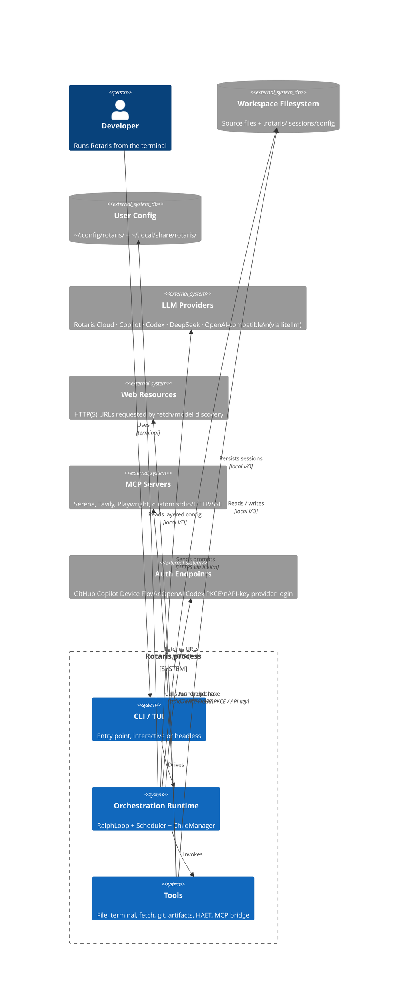

# 01 — System Context

> Perspective: Who uses the system, what external systems exist, and how they connect.
> Diagram type: C4Context

---

Rotaris is a single-process, asyncio-based Python application. The user interacts
via a terminal (TUI or headless CLI). Outbound I/O goes to the local filesystem,
LLM provider APIs and model-discovery endpoints, optional MCP servers, direct web
fetches requested through tools, and OAuth/API-key endpoints during authentication
or provider setup.

