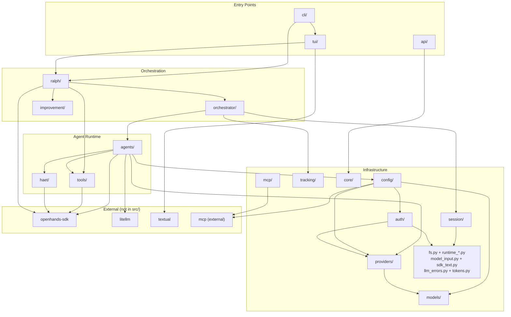

# 02 — Code Topology

> Perspective: Physical repository layout and principal dependency graph between packages.
> Diagram type: Graph

---

The single Python package `src/rotaris_core/` is divided into cohesive sub-packages.
Arrows show dominant import dependency direction (A → B means A imports from B);
small leaf modules such as `tokens.py`, `model_input.py`, `sdk_text.py`, and
`llm_errors.py` are shown with infrastructure because they are shared runtime
support rather than architectural entry points.

Within `orchestrator/`, `scheduler.py` remains the public `Scheduler` façade for
Ralph Loop callers. The per-child `LocalConversation` execution loop lives in
`child_run.py`, delegation drain and parent-resume behavior lives in
`scheduler_drain.py`, and terminal report policy lives in
`child_report_builder.py`. This keeps the public Scheduler seam stable while
concentrating the highest-churn execution details in deeper modules.

Within `tui/`, `app.py` remains the public `RotarisTuiApp` façade. The run
orchestration path now lives in `app_run.py`, while `app_models.py`,
`app_navigation.py`, `app_artifacts.py`, `app_settings.py`, and
`app_runtime.py` hold the extracted model/session, navigation, artifact,
settings, and transcript/runtime helpers that `RotarisTuiApp` delegates to.
