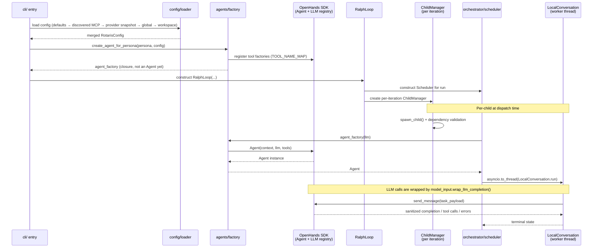

# 03 — Integration Protocol

> Perspective: Runtime handshake between independently-deployed units — what loads when
> and in what order.
> Diagram type: Sequence

---

The key integration boundary is between the Rotaris process and the OpenHands SDK.
Config loading starts from built-in defaults, overlays discovered MCP servers and
the provider/model project snapshot, then applies global and workspace YAML.
A persona factory is registered at startup. `RalphLoop` constructs and owns one
`Scheduler` for the run and creates a fresh `ChildManager` for each iteration.
Each child agent is constructed on demand before `Scheduler.run_child()` wraps
the synchronous `LocalConversation.run()` in a worker thread. Every LLM completion
is routed through `model_input.wrap_llm_completion()`, which sanitizes stale prompt
history, synthesizes missing tool responses, redacts malformed tool-error payloads,
progressively truncates old tool output under context pressure, injects
`reasoning_content` echo-back placeholders for thinking-mode models, and samples
serialization validation as a production guardrail.

