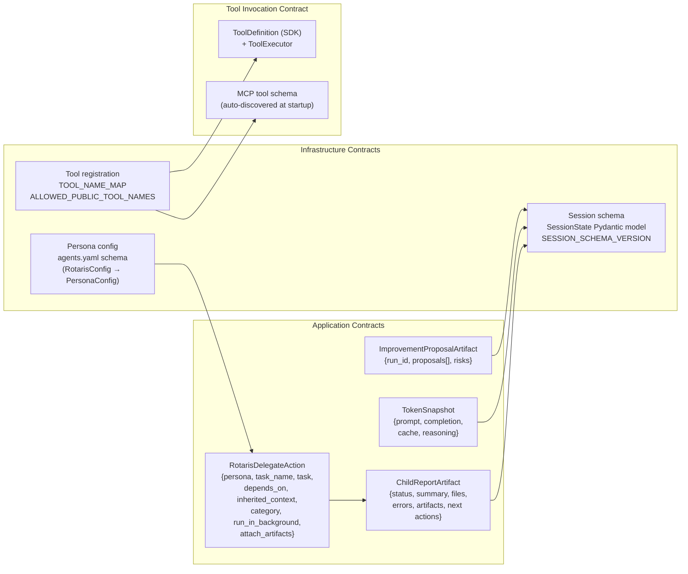

# 04 — Contract Layers

> Perspective: Formal interfaces that separate concerns — infrastructure contracts vs.
> application contracts.
> Diagram type: Graph + Table

---

## Key Contract Invariants

| Contract                       | Owner                           | Invariant                                                                               |
| ------------------------------ | ------------------------------- | --------------------------------------------------------------------------------------- |
| `PersonaConfig`                | `config/schema.py`              | `tools` list contains only names from `ALLOWED_PUBLIC_TOOL_NAMES`                       |
| `ChildReportArtifact`          | `orchestrator/report.py`        | Parent reads child results through structured summaries/artifacts, not raw transcript   |
| `ChildTaskRecord.transition()` | `orchestrator/child_state.py`   | All state changes go through `transition()` — direct `record.state =` is forbidden      |
| `RotarisDelegateAction`         | `orchestrator/delegate_tool.py` | `depends_on` task IDs are normalized to child canonical names; unknown deps and cycles are rejected at spawn time |
|                                |                                 | Runtime policy defaults cap depth at 3, total children at 20, and active children at 6; per-model `max_parallel` uses an idle queue, not hard rejection |
| `SessionState` schema version  | `session/state.py`              | New fields must have defaults; bump `SESSION_SCHEMA_VERSION` only on breaking changes   |
| `TOOL_NAME_MAP`                | `agents/factory.py`             | Friendly config names map 1:1 to SDK class names; add here when creating tools          |
