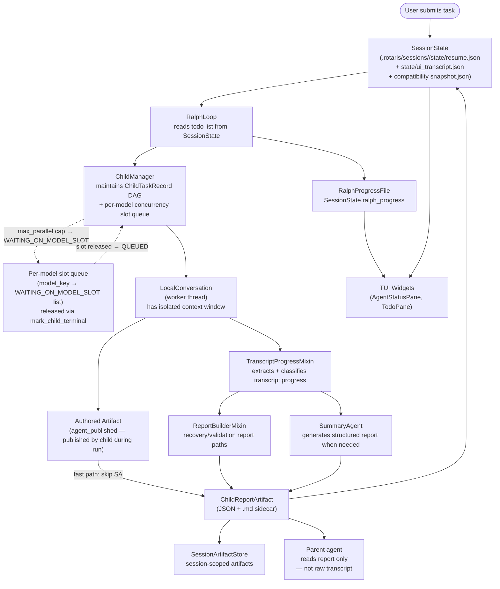

# 05 — Data / Context Flow

> Perspective: How shared state or context propagates from producers to consumers.
> Diagram type: Flowchart

---

Rotaris has no external state service. Durable session context travels through
`SessionState` JSON on disk: the current layout writes split files under
`state/`, `evidence/`, and `artifacts/`, while `snapshot.json` remains as a
compatibility copy. `metadata.json` and `summary.md` are derived sidecars.
In-process context flows via direct object references within the same asyncio
event loop and worker threads.

## Artifact-Backed Fast Path

When a child publishes an `agent_published` authored artifact during its
run (via `artifact_write`), the scheduler detects it in
`_build_terminal_child_report` via `_get_latest_authored_artifact()`. The
summary agent is skipped entirely and the `ChildReportArtifact` is
constructed directly from the artifact body (`_build_artifact_backed_report`).
This saves one LLM call per child and preserves the child's original
structured output (plans, research, code changes) as the canonical response
without paraphrasing through a second model.

## State Ownership Rules

| State                           | Mutable by                                                           | Consumers                                   |
| ------------------------------- | -------------------------------------------------------------------- | ------------------------------------------- |
| `SessionState.todo_state`       | `ralph/loop.py` + TUI loop                                           | RalphLoop, TUI TodoPane                     |
| `ChildTaskRecord.state`         | `ChildTaskRecord.transition()` only                                  | Scheduler, ChildManager                     |
| `ChildTaskRecord.model_key`     | `RotarisDelegateExecutor._resolve_model_parallelism()`                | `ChildManager._count_model_active_locked()` |
| `_model_slot_queues`            | `ChildManager.enqueue_model_slot()` / `_release_model_slot_locked()` | `ChildManager.resolve_ready_children()`     |
| `_model_max_parallel`           | `ChildManager.enqueue_model_slot()`                                  | `ChildManager._count_model_active_locked()` |
| `ChildReportArtifact`           | `SummaryAgent`, `ReportBuilderMixin`, or authored artifact           | Parent agents, artifact store               |
| `SessionArtifactStore`          | `orchestrator/artifacts.py`                                          | Artifact tools, TUI, post-run               |
| `Authored Artifact`             | Child agent via `artifact_write` tool                                | Scheduler (bypasses `SummaryAgent`)         |
| `RalphProgressFile`             | `ralph/loop.py`                                                      | TUI, session resume context                 |
| `LLM.metrics` + `GlobalTracker` | OpenHands SDK + scheduler callbacks                                  | `tokens.py`, `session/metrics.py`           |

## Diagnostics Evidence

Every session produces a diagnostics payload in `evidence/`. Each artifact is
written by `session/diagnostics.py` with `orchestrator/scheduler.py` as the
primary data source for tool-call timing, stall detection, and timeout events.

| Evidence File                  | Key Fields                                                                                                | Enriched By Our Changes                                                                 |
| ------------------------------ | --------------------------------------------------------------------------------------------------------- | --------------------------------------------------------------------------------------- |
| `evidence/tool-calls.jsonl`    | `agent_name`, `tool_name`, `call_id`, `status`, `elapsed_ms`, `is_error`                                  | On error: `args` (tool input) and `result` (tool output) — both truncated to 2000 chars |
| `evidence/debug.log`           | Log lines at WARNING level (configurable via `session_log_level`)                                         | `session_log_level` field in `RuntimePolicy` controls verbosity                         |
| `state/run_config.json`        | `config_snapshot` with all persona configs                                                                | `resolved_system_prompt` added for each persona (resolved from `system_prompt_file`)    |
| `issues.json` (stall issues)   | `kind="stall"`, `metadata` with `active_tools`, `recent_tool_calls`, `last_llm_event_type`                | Enriched with `active_tools`, `recent_tool_calls`, `last_llm_event_type`                |
| `issues.json` (timeout issues) | `kind="timeout"`, `metadata` with `elapsed_s`, `active_tools`, `recent_tool_calls`, `last_llm_event_type` | Enriched with `active_tools`, `recent_tool_calls`, `last_llm_event_type`                |

The stall watchdog (`_run_with_stall_watchdog` in `scheduler.py`) periodically
records recent tool calls and the last LLM event type so that when a stall or
timeout fires, the issue metadata documents the child's latest activity — not
just the elapsed wall time.
