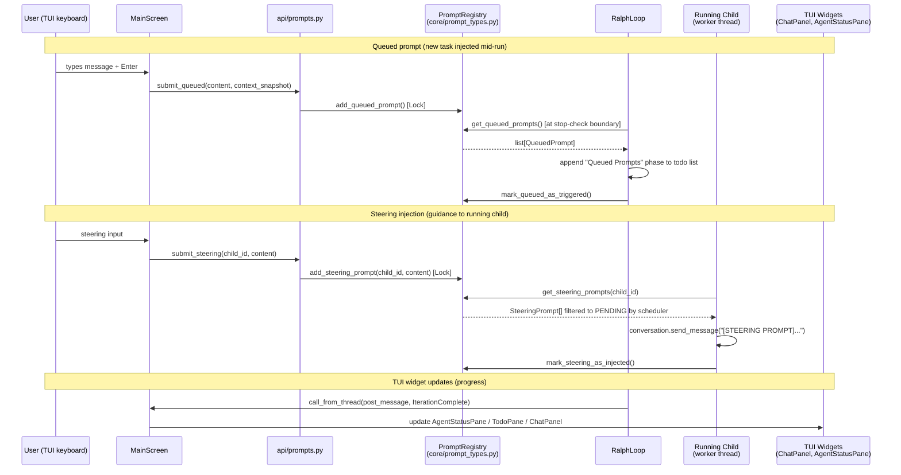

# 06 — Event / Message Bus

> Perspective: Who emits what messages, who listens, and what payloads travel.
> Diagram type: Sequence

---

Rotaris does not use an external message broker. Communication between components
uses four mechanisms: direct function calls (in-process), `PromptRegistry`
(thread-safe singleton for cross-thread queued/steering prompts), the small
`api/prompts.py` façade for programmatic prompt submission, and Textual's widget
message system (TUI events). There is no pub/sub topology; all channels are
point-to-point.

