# 07 — Routing Map

> Perspective: Who owns which entry path, how paths compose, and what gates each route.
> Diagram type: Graph

---

Rotaris has two entry binaries and several runtime/configuration paths.
"Routing" here means CLI argument routing and screen navigation inside the TUI —
not HTTP routing.

```mermaid
graph TD
    BIN_MAIN["Rotaris\n(cli/app.py — Typer)"]
    BIN_HL["rotaris-headless\n(cli/argparse_app.py)"]

    subgraph "CLI Routing"
        CHECK_BG{"--background flag\n+ non-empty task?"}
        ROUTE_TUI["Launch RotarisTuiApp (TUI)"]
        ROUTE_BG["cli/background.py\n(headless run)"]
    end

    subgraph "TUI Screen Navigation"
        MAIN["MainScreen (default)"]
        PALETTE["Command palette\nCtrl+P"]
        SESS_PICKER["SessionPickerScreen (modal)\ncommand palette"]
        MCP_MODAL["MCPServersScreen (modal)\ncommand palette or /mcp"]
        MODEL_MODAL["RuntimeModelsScreen (modal)\nCtrl+M"]
        STARTUP_MODAL["StartupModelsScreen (modal)\nfirst-run / login"]
        PROPOSALS["ImprovementProposalsScreen (modal)\ncommand palette / post-run"]
        TOOL_SETTINGS["ToolResultSettingsScreen (modal)\ncommand palette"]
        COMP_SETTINGS["CompressionSettingsScreen (modal)\ncommand palette"]
        PROVIDER_SETTINGS["ProviderSettingsScreen (modal)\nquota flow / command palette"]
        DEV_OPTIONS["DevOptionsScreen (modal)\ncommand palette"]
        SEARCH["TranscriptSearchScreen (modal)\ncommand palette / slash command"]
        SHORTCUTS["ShortcutHelpScreen / CommandPaletteCheatsheetScreen"]
        QUOTA["QuotaWaitScreen (modal)\nprovider quota wait"]
        ARTIFACT_EDITOR["ArtifactEditor\nAlt+Right / Alt+Left navigation"]
    end

    subgraph "Subcommands"
        RUN["rotaris-cli run"]
        SESSIONS["rotaris-cli sessions"]
        VERSION["rotaris-cli version"]
        LOGIN["rotaris-cli login"]
        LOGOUT["rotaris-cli logout"]
        MODELS["rotaris-cli models refresh"]
        PROVIDERS["Rotaris providers list|set-key|set-base-url|validate|reauth"]
        CONFIG_CMD["rotaris-cli config set-tavily-key"]
        SECRETS["rotaris-cli secrets set|unset|unset-all|list"]
    end

    BIN_MAIN --> CHECK_BG
    CHECK_BG -->|"yes"| ROUTE_BG
    CHECK_BG -->|"no"| ROUTE_TUI
    BIN_HL --> ROUTE_BG

    ROUTE_TUI --> MAIN
    MAIN --> PALETTE
    PALETTE --> SESS_PICKER
    PALETTE --> MCP_MODAL
    PALETTE --> MODEL_MODAL
    PALETTE --> STARTUP_MODAL
    PALETTE --> PROPOSALS
    PALETTE --> TOOL_SETTINGS
    PALETTE --> COMP_SETTINGS
    PALETTE --> PROVIDER_SETTINGS
    PALETTE --> DEV_OPTIONS
    PALETTE --> SEARCH
    PALETTE --> SHORTCUTS
    MAIN --> SESS_PICKER
    MAIN --> MCP_MODAL
    MAIN --> MODEL_MODAL
    MAIN --> STARTUP_MODAL
    MAIN --> PROPOSALS
    MAIN --> TOOL_SETTINGS
    MAIN --> COMP_SETTINGS
    MAIN --> PROVIDER_SETTINGS
    MAIN --> DEV_OPTIONS
    MAIN --> SEARCH
    MAIN --> SHORTCUTS
    MAIN --> QUOTA
    MAIN --> ARTIFACT_EDITOR

    BIN_MAIN --> RUN
    BIN_MAIN --> SESSIONS
    BIN_MAIN --> VERSION
    BIN_MAIN --> LOGIN
    BIN_MAIN --> LOGOUT
    BIN_MAIN --> MODELS
    BIN_MAIN --> PROVIDERS
    BIN_MAIN --> CONFIG_CMD
    BIN_MAIN --> SECRETS
```

