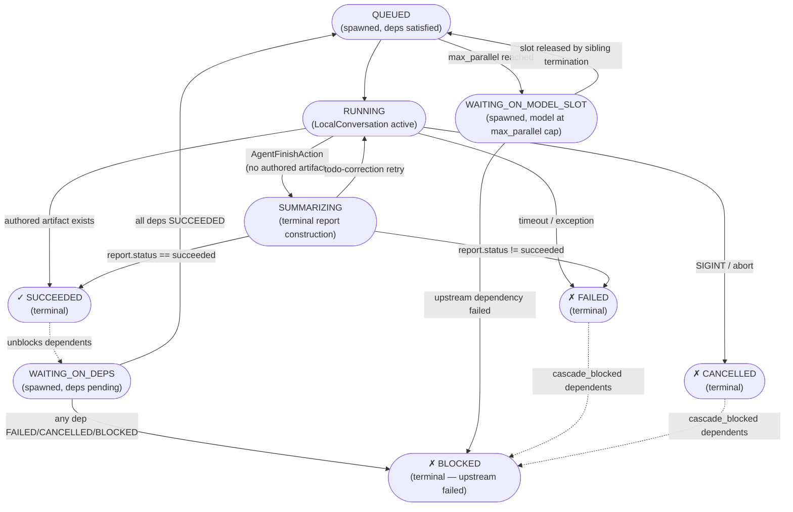
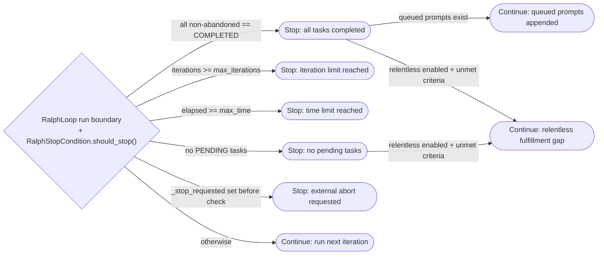
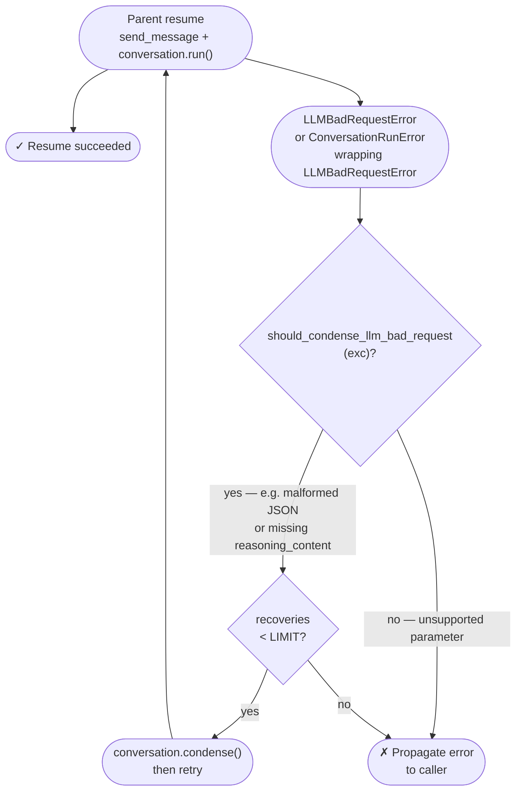

# 08 — Loading & Error Lifecycle

> Perspective: The state machine for executing a child agent — happy path and every
> failure branch.
> Diagram type: Flowchart

---

## Child Task State Machine

Every delegated child moves through these states. All transitions go through
`ChildTaskRecord.transition()` — direct state assignment is forbidden.

### Per-Model Concurrency Slot Queue

When a delegate-call targets a model whose `max_parallel` cap is already
reached (e.g. 3/3 children active on `deepseek/deepseek-v4-pro`), the child
does **not** get rejected. Instead the `RotarisDelegateExecutor` enqueues it
into `WAITING_ON_MODEL_SLOT` via `ChildManager.enqueue_model_slot()`. The
child stays idle until a sibling on the same model terminates and releases
the slot via `_release_model_slot_locked()`. At that point the child
transitions to `QUEUED` and is picked up by the next scheduler drain cycle.

`WAITING_ON_MODEL_SLOT` children are excluded from `active_count` (they do
not count toward `max_active_children`). Only `RUNNING` and `SUMMARIZING`
children are counted toward `max_parallel`.

---

The dotted cascade lines are side effects on dependent child records, not
transitions of the terminal record itself. `Scheduler.run_child()` delegates the
per-child execution loop to `orchestrator/child_run.py`; the public Scheduler
seam remains stable while the implementation owns callbacks, watchdog use,
steering injection, retry/fallback loops, and final report handoff.

The `SUMMARIZING` state is **skipped** when a child has produced an
`agent_published` authored artifact during its run. The report policy in
`orchestrator/child_report_builder.py` detects this via
`_get_latest_authored_artifact()` and builds the terminal report directly from
the artifact body, bypassing the `SummaryAgent` entirely.
This avoids an unnecessary LLM call when the child has already published
a structured artifact (plan, research results, edited code) as its response.

## Ralph Loop Stop Conditions

## Parent Resume Recovery (LLM Bad Request Retry)

When a parent agent resumes after delegated children complete, the scheduler
calls `_resume_parent_conversation_with_recovery()`. This method wraps the
resume in a retry loop that handles two classes of LLM errors:

### Error Classification

| Exception                                              | Catch site                                                          | Action                                                                                                                                                                                |
| ------------------------------------------------------ | ------------------------------------------------------------------- | ------------------------------------------------------------------------------------------------------------------------------------------------------------------------------------- |
| `LLMBadRequestError`                                   | Caught directly by `except _llm_bad_request_errors`                 | Condense context and retry (up to `_LLM_BAD_REQUEST_RECOVERY_LIMIT` = 2)                                                                                                              |
| `ConversationRunError` (wrapping `LLMBadRequestError`) | Caught by `except RuntimeError`, unwrapped via `original_exception` | Condense context and retry (up to 2); this path is new — `conversation.run()` wraps all errors in `ConversationRunError`, so the direct `LLMBadRequestError` catch was never matching |

The `should_condense_llm_bad_request()` gate ensures only recoverable
errors trigger condensation. Errors like "unsupported parameter" (e.g. Codex
rejecting `prompt_cache_retention`) propagate directly without retry.

### Reasoning Content Echo-Back

DeepSeek V4 models with thinking mode enabled (`reasoning_effort="high"`,
`extra_body={"thinking": {"type": "enabled"}}`) require that every prior
assistant message's `reasoning_content` field be included in subsequent
API requests. If the field is missing on any assistant message, DeepSeek
returns a 400 error:

> `"The reasoning_content in the thinking mode must be passed back to the API."`

Four layers protect against this:

| Layer                       | Mechanism                                                                                                                                                                                                                                                                                                      | Location                                                                                                          |
| --------------------------- | -------------------------------------------------------------------------------------------------------------------------------------------------------------------------------------------------------------------------------------------------------------------------------------------------------------- | ----------------------------------------------------------------------------------------------------------------- |
| **Prevention**              | When `thinking=None` (not configured) and the provider is `deepseek`, `load_llm_for_model` strips the SDK default `reasoning_effort="high"` post-initialisation                                                                                                                                                | `config/loader.py`                                                                                                |
| **Preventive Sanitization** | On every LLM completion, `sanitize_completion_messages()` invokes Phase D: `_ensure_reasoning_content()` scans all assistant messages and injects an empty-string `reasoning_content` placeholder when the field is missing. Only activates for models where `model_requires_reasoning_echo()` returns `True`. | `model_input.py`, gated by `models/thinking_catalog.py`                                                           |
| **Repair**                  | On session load, `repair_reasoning_content()` scans persisted event files in `evidence/conversations/event_logs/` and patches missing `reasoning_content` fields with an empty string. Only runs for models where `model_requires_reasoning_echo()` returns `True`.                                            | `session/state_repair.py`, wired via `SessionManager._repair_reasoning_content_on_load()` in `session/manager.py` |
| **Recovery**                | If the error still reaches the scheduler, `_resume_parent_conversation_with_recovery` catches the `ConversationRunError`, unwraps it, and runs `conversation.condense()` before retrying                                                                                                                       | `orchestrator/scheduler.py`                                                                                       |

The repair layer runs only at session-open time. The preventive sanitization
layer runs on every LLM call, catching cases where reasoning content was lost
during normal agent iteration (e.g. after serialisation round-trips through
Pydantic `model_dump`).
