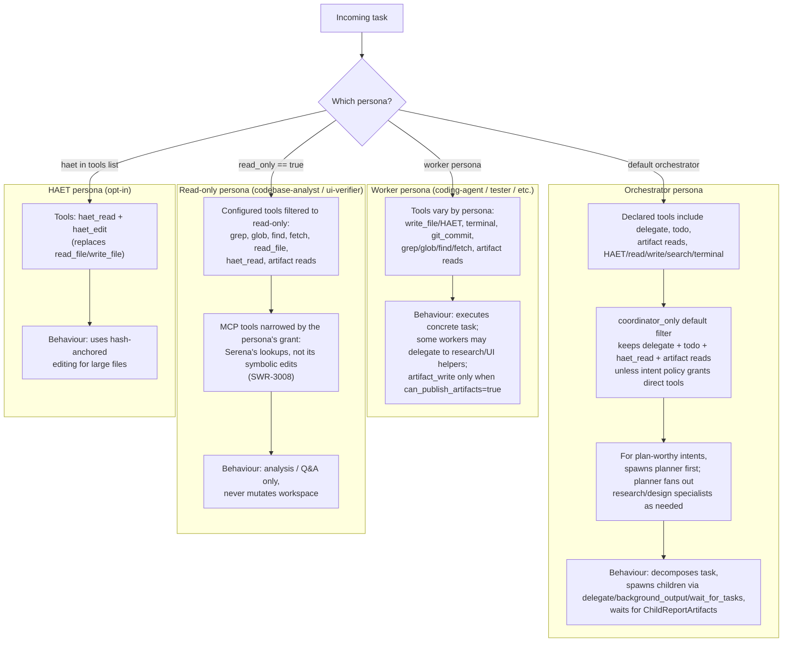

# 09 — Role / Persona Branching

> Perspective: How the system behaves differently per persona type. Decision tree per
> role.
> Diagram type: Flowchart

---

Personas are named agent roles defined in `agents.yaml`, with defaults in
`config/defaults.py`. The system does not have user-facing authentication roles
(student/admin/etc.); instead, branching happens on two independent axes:

1. **Persona capability** — tool lists, delegation permission, artifact publishing,
   read-only/coordinator-only filters, MCP servers, and model assignment. Governs what a
   persona *can* do. Flowchart below.
2. **Playbook cell** — persona × classified intent × model tier. Governs how the persona
   *works* on this particular run: autonomy, research policy, task sizing, verification
   ownership, artifact duties, report shape, and fan-out budget. See
   [prompt-composition-matrix.md](prompt-composition-matrix.md).

The two are deliberately orthogonal: a playbook cell may never reference a tool the
capability axis has filtered away.

## Playbook Branching

Whether the orchestrator opens with `planner`, runs a research wave, or delegates straight
to the implementer is **not fixed per intent**. It is the `ROUTE` slot of the orchestrator's
resolved playbook cell, and that cell is keyed on the model tier of the persona that will
actually implement the work (`coding-agent` for most intents; `refactorer`,
`requirements-engineer`, or `architect` for `refactor`, `requirements`, `architectural`).

The same intent therefore branches differently by delegate capacity:

| Intent | implementation owner = `small_model` | `large_model` |
| --- | --- | --- |
| `small_feature` | research wave → micro-slices → tester | delegate once; the owner explores and tests itself |
| `moderate_feature` | `planner` first, research published as an artifact, micro-slices | delegate once, whole feature |
| `refactor` | research-then-code, micro-slices | direct, whole feature |

Read-only personas (`codebase-analyst`, `verifier`, `ui-verifier`, `librarian`) are largely
tier-invariant on route and sizing, but vary on research depth and report strictness.
`intent-classifier` has no cell at all — it runs before a classification exists.

The `BUDGET` slot is the one that binds the runtime rather than only the prompt:
`clamp_policy_to_budget` narrows `max_active_children` / `max_children` / `max_depth` for the
iteration's `ChildManager`.

## Model Tier Assignment

Each persona references a model key in `agents.yaml`. Built-in defaults use aliases
such as `small_model`, `medium_model`, and `large_model`; config loading resolves
those aliases to concrete model entries. The TUI can also apply a session-local
runtime model override without rewriting persistent startup defaults.

Tier is not only a routing detail for the model registry — it is the second axis of the
playbook matrix, so changing a persona's tier changes how every other persona is instructed
to work with it.
