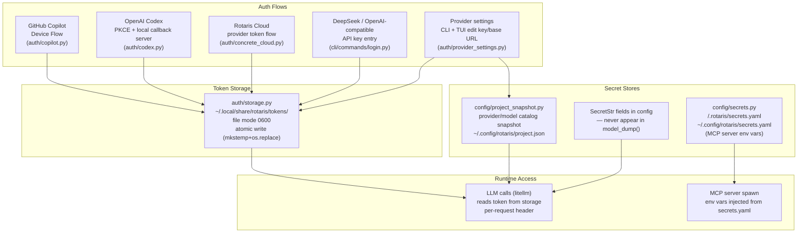

# 10 — Authorization Boundaries

> Perspective: Where auth decisions are made, what data flows where, and what is
> enforced vs. demonstrative.
> Diagram type: Graph + Table

---

## Enforcement vs. Demonstrative Controls

| Control                                           | Type     | Where enforced                                           |
| ------------------------------------------------- | -------- | -------------------------------------------------------- |
| OAuth token storage at `0600`                     | Enforced | `auth/storage.py` — `os.chmod` on write                  |
| `SecretStr` redacts `api_key` from logs/dumps     | Enforced | Pydantic type system                                     |
| Workspace path containment (file tools)           | Enforced | `tools/file_engine.py` + `haet/engine.py:resolve_path()` |
| Read-before-write on file edits                   | Enforced | `tools/file_write.py` + read ledger                      |
| `git_commit` restricted to local commits only     | Enforced | `tools/git_commit.py` — no push/pull/rebase              |
| MCP secrets not logged                            | Enforced | `resolve_server_env` reads directly into env, not logged |
| Provider API keys edited from CLI/TUI             | Enforced | `auth/provider_settings.py` stores keys through `TokenStorage`, not YAML |
| OAuth PKCE local server bound to `127.0.0.1` only | Enforced | `auth/codex.py` — localhost binding                      |
| Personas cannot exceed runtime child caps         | Enforced | `ChildManager.spawn_child()` validates depth, total children, and active children |
| Conversation workspace matches configured root    | Enforced | `Scheduler._validate_conversation_workspace()`           |
