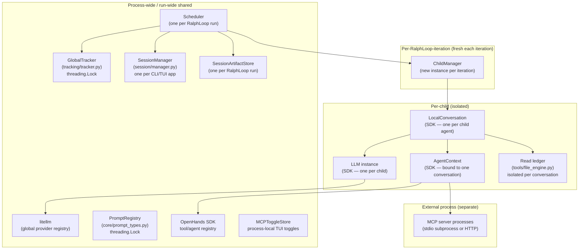

# 11 — Dependency Sharing

> Perspective: Which libraries are singletons, which are process-shared, which are
> per-agent private.
> Diagram type: Graph

---

## Key Sharing Rules

- `PromptRegistry` and `GlobalTracker` are shared across threads — both use `threading.Lock`.
- `Scheduler` is reused for a `RalphLoop` run; `ChildManager` is **not** shared between Ralph iterations.
- `SessionArtifactStore` is session-scoped and survives across iterations so sibling summaries and authored artifacts can be reused.
- `MCPToggleStore` is process-local TUI state; persisted config still comes from `mcp_servers:`.
- Each `LocalConversation` has its own `LLM` instance with isolated `LLM.metrics` — token counts are per-child, never global.
- The read ledger (`FileToolEngine`) is scoped to one conversation — a child cannot accidentally satisfy another child's read requirement.
