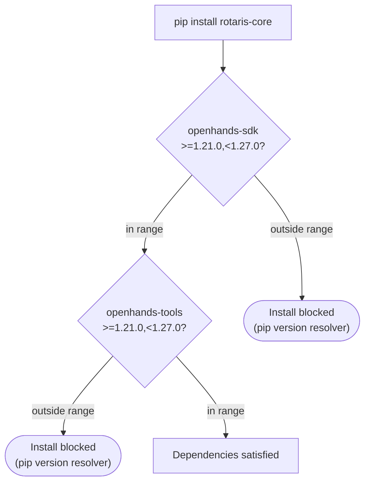
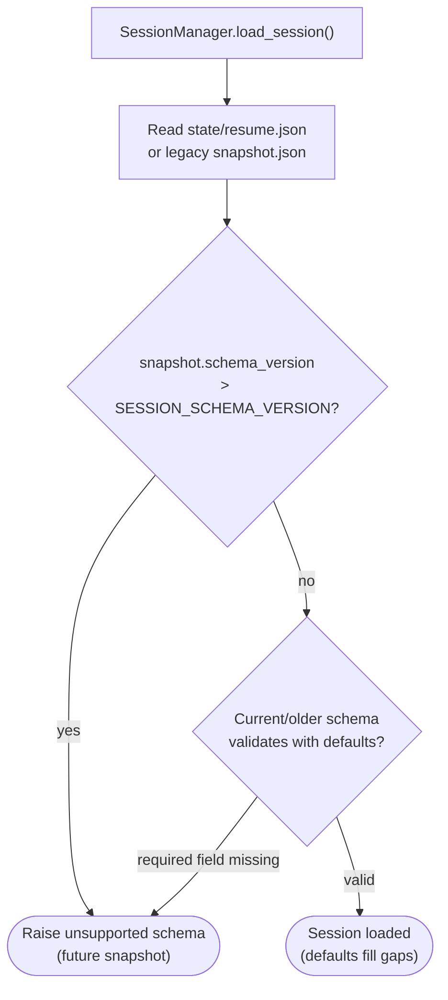

# 13 — Version Compatibility

> Perspective: Version gates, what blocks vs. warns, and upgrade coordination rules.
> Diagram type: Flowchart

---

## SDK and Dependency Version Gates

## Session Schema Version Gate

## Upgrade Rules

| Rule                                | Scope                    | Trigger                                                      |
| ----------------------------------- | ------------------------ | ------------------------------------------------------------ |
| `SESSION_SCHEMA_VERSION` bump       | `session/state.py`       | Only on breaking changes (removing/renaming required fields) |
| New `SessionState` field            | `session/state.py`       | Always add a default value — never require it                |
| `pyproject.toml` version bump       | repo-wide                | After every feature addition or bug fix (semver)             |
| SDK/tool upper bound `<1.27.0`      | `pyproject.toml`         | Pins to the OpenHands SDK/tools minor range this integration is tested against |
