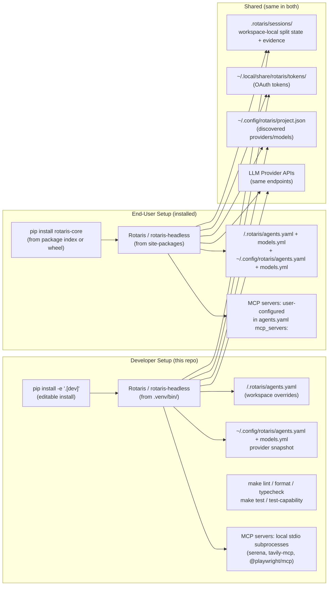

# 15 — Dev / Prod Topology

> Perspective: How the system runs in development vs. how it runs for end users.
> Diagram type: Graph

---

Rotaris has no server component and no deployment topology in the traditional sense.
"Dev" vs "prod" is a distinction in configuration paths and tool availability.

## Key Differences

| Aspect           | Dev                                              | End-user                        |
| ---------------- | ------------------------------------------------ | ------------------------------- |
| Install mode     | `pip install -e '.[dev]'` (editable)             | `pip install rotaris-core` (wheel) |
| Source changes   | Immediately reflected                            | Requires reinstall              |
| Extra deps       | `pytest`, `ruff`, `mypy`, `textual-dev`, `respx`, snapshot tooling | Not installed                   |
| Capability tests | `make test-capability` (needs live LLM)          | Not applicable                  |
| Config source    | Often workspace `.rotaris/` in this repo       | User's project directory        |
