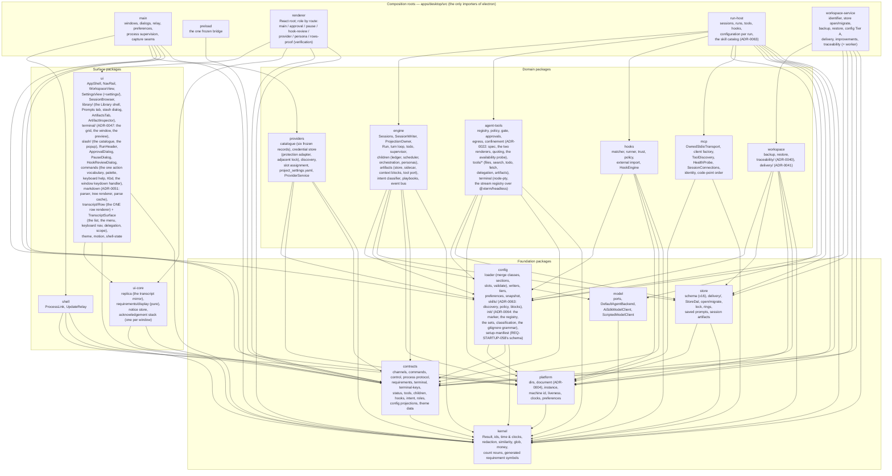

# Component view — packages and the edges between them — The packages

Part 1 of 4 of [the component view](../01-component-view.md), which indexes every part.

## The packages

```mermaid
flowchart TB
  subgraph roots["Composition roots — apps/desktop/src (the only importers of electron)"]
    main["main<br/>windows, dialogs, relay, preferences,<br/>process supervision, capture seams"]
    preload["preload<br/>the one frozen bridge"]
    renderer["renderer<br/>React root; role by route:<br/>main / approval / pause / hook-review /<br/>provider / persona / rows-proof (verification)"]
    runhost["run-host<br/>sessions, runs, tools, hooks,<br/>configuration per run,<br/>the skill catalog (ADR-0063)"]
    wsservice["workspace-service<br/>identifier, store open/migrate,<br/>backup, restore, config Tier A,<br/>delivery, improvements, traceability (+ worker)"]
  end

  subgraph surface["Surface packages"]
    ui["ui<br/>AppShell, NavRail, WorkspaceView,<br/>SettingsView (+settings/), SessionBrowser,<br/>library/ (the Library shell, Prompts tab, stash dialog,<br/>ArtifactsTab, ArtifactInspector),<br/>terminal/ (ADR-0047: the grid, the window, the preview),<br/>slash/ (the catalogue, the popup), RunHeader,<br/>ApprovalDialog, PauseDialog, HookReviewDialog,<br/>commands (the one action vocabulary, palette,<br/>keyboard help, Kbd, the window keydown handler),<br/>markdown (ADR-0051: parser, tree renderer, parse cache),<br/>transcript/Row (the ONE row renderer) + TranscriptSurface<br/>(the list, the menu, keyboard nav, delegation, scope),<br/>theme, motion, shell-state"]
    uicore["ui-core<br/>replica (the transcript mirror),<br/>requirements/display (pure),<br/>notice store,<br/>acknowledgement stack (one per window)"]
    shell["shell<br/>ProcessLink, UpdateRelay"]
  end

  subgraph domain["Domain packages"]
    engine["engine<br/>Sessions, SessionWriter, ProjectionOwner,<br/>Run, turn loop, todo, supervisor,<br/>children (ledger, scheduler, orchestration, personas),<br/>artifacts (store, sidecar, context blocks, tool port),<br/>intent classifier, playbooks, event bus"]
    tools["agent-tools<br/>registry, policy, gate, approvals,<br/>egress, confinement (ADR-0022: spec, the two<br/>renderers, quoting, the availability probe),<br/>tools/* (files, search, todo, fetch,<br/>delegation, artifacts), terminal (node-pty,<br/>the stream registry over @xterm/headless)"]
    hooks["hooks<br/>matcher, runner, trust, policy,<br/>external import, HookEngine"]
    providers["providers<br/>catalogue (six frozen records), credential store<br/>(protection adapter, adjacent lock), discovery,<br/>slot assignment, project_settings.yaml, ProviderService"]
    workspace["workspace<br/>backup, restore,<br/>traceability/ (ADR-0040), delivery/ (ADR-0041)"]
    mcp["mcp<br/>OwnedStdioTransport, client factory,<br/>ToolDiscovery, HealthProbe, SessionConnections,<br/>identity, code-point order"]
  end

  subgraph foundation["Foundation packages"]
    config["config<br/>loader (merge classes, sections,<br/>slots, validate), writers, tiers,<br/>preferences, snapshot,<br/>skills/ (ADR-0063: discovery, policy, blocks),<br/>init/ (ADR-0064: the marker, the registry,<br/>the sets, classification, the gitignore grammar),<br/>setup-manifest (REQ-STARTUP-058's schema)"]
    model["model<br/>ports, DefaultAgentBackend,<br/>AiSdkModelClient, ScriptedModelClient"]
    store["store<br/>schema (v16), delivery/, StoreDal, open/migrate,<br/>lock, rings,<br/>saved prompts, session artifacts"]
    platform["platform<br/>dirs, document (ADR-0004), instance,<br/>machine id, liveness, clocks, preferences"]
    contracts["contracts<br/>channels, commands, control, process protocol,<br/>requirements, terminal, terminal-keys,<br/>status, tools, children, hooks, intent, roles,<br/>config projections, theme data"]
    kernel["kernel<br/>Result, ids, time & clocks,<br/>redaction, similarity, glob, money,<br/>count nouns, generated requirement symbols"]
  end

  main --> shell & providers & config & platform & contracts & kernel
  preload --> contracts
  renderer --> ui & uicore & contracts & kernel
  runhost --> engine & tools & hooks & model & mcp & config & store & platform & contracts & kernel
  wsservice --> workspace & config & store & platform & contracts & kernel
  ui --> uicore & contracts & kernel
  uicore --> contracts & kernel
  shell --> platform & contracts & kernel
  engine --> model & config & store & platform & contracts & kernel
  tools --> config & store & platform & contracts & kernel
  hooks --> config & platform & contracts & kernel
  providers --> config & platform & contracts & kernel
  workspace --> config & store & platform & contracts & kernel
  mcp --> platform & kernel
  config --> platform & contracts & kernel
  model --> kernel
  store --> platform & kernel
  platform --> kernel
  contracts --> kernel
```
