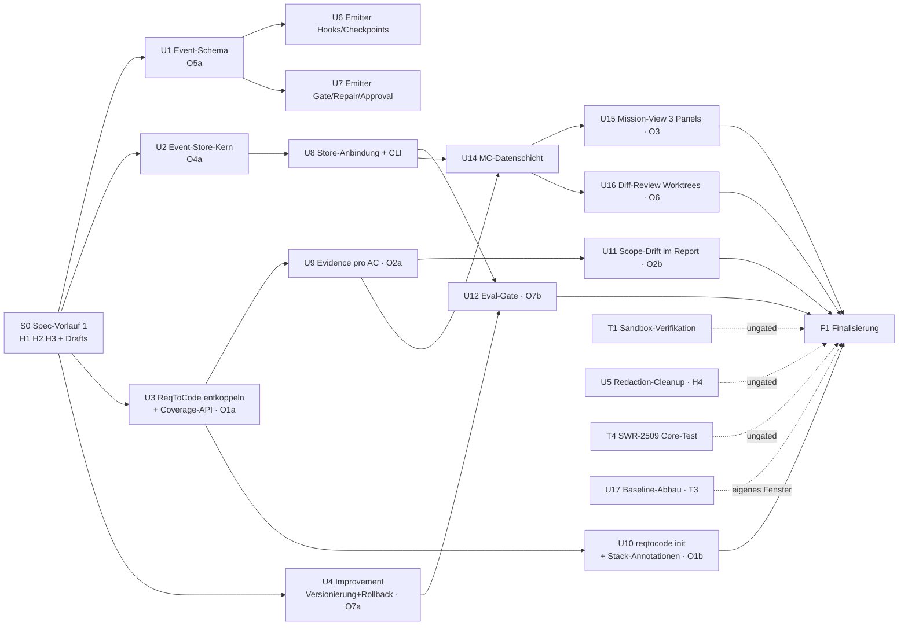

# Phase 2 — Parallelisierungsplan (2026-08-09)

> Arbeitsliste: [`2026-08-09-marktanalyse-offene-punkte.md`](2026-08-09-marktanalyse-offene-punkte.md)
> (Punkte O1–O7, H1–H5, T1–T4)
> Vorbild für Format und Regeln: [`2026-08-08-epic-p1-market-readiness.md`](2026-08-08-epic-p1-market-readiness.md)
> und `.claude/skills/epic-orchestration/SKILL.md`.
>
> Dieses Dokument beantwortet genau zwei Fragen: **was kann gleichzeitig laufen** und
> **was ist wodurch blockiert**. Es ersetzt keine Requirements — die entstehen in den
> Spec-Vorläufen S0/S1 (Abschnitt 5).

---

## 0. Stand nach Welle 1 (2026-08-09)

**S0 und Welle 1 sind ausgeliefert**, integriert auf `epic/phase2-differenzierung`.
Sieben Units parallel, **null Merge-Konflikte** — der Dateibesitz-Schnitt hat gehalten.

| Unit | Inhalt | PR |
| --- | --- | --- |
| U1 | Eventtypen für Hooks/Checkpoints/Gate/Approval (SWR-1831) | #59 |
| U2 | Event-Store: Persistenz, Query/Replay, Export (SWR-2901–2903) | #64 |
| U3 | ReqToCode-Portabilität + Coverage-API (SWR-2335–2337) | #63 |
| U4 | Improvement-Historie, Rollback, CLI (SWR-1640–1642) | #65 |
| U5 | Core-Test für SWR-2509 | #60 |
| U6 | Sandbox-Verifikationsprotokoll (SWR-2507) | #61 |
| U7 | Redaction-Guard-Test (SWR-2118–2121) | #62 |

Gates auf dem integrierten Stand: `reqtocode check` grün (Stats unverändert),
`tests/unit` 3574 passed / 0 failed, `tests/integration` 326 passed,
`apps/rotaris/tests` 513 passed, Naht-Test Schema↔Store 5 passed.

**Korrekturen am Plan, die die Umsetzung erzwungen hat:**

1. **U5 (H4, Redaction-Cleanup) hatte keinen Code-Anteil** — es existiert kein
   Phantom-Toggle; aus dem Cleanup-Unit wurde ein Guard-Test-Unit (U7). Der Besitzkonflikt
   auf `settings.py` entfiel damit ganz.
2. **U3 war billiger als angenommen**: `reqtocode` importiert kein Nicht-`reqtocode`-Modul
   und ist stdlib-only; die Kopplung waren nur hart kodierte Pfade. Und die Coverage-Map
   existierte bereits (`Sweep.impl_traces`/`test_coverage`) — SWR-2336 ist ein dünner
   Wrapper. Der kritische Pfad ist dadurch kürzer als in Abschnitt 7 geschätzt.
3. **Eine Duplizierung ist entstanden, verursacht durch genau diesen Schnitt**: die
   Drift-Regel (`_dirty_paths`/`_drift_baseline`) liegt jetzt in
   `session/checkpoint_restore.py` **und** `improvement/rollback.py`, weil U4 die
   Session-Dateien nicht anfassen durfte. Sie stimmen heute überein; eine
   Sicherheitsregel, die zweimal existiert, bleibt das nicht. Siehe
   [docs/bug/2026-08-09-two-implementations-of-the-checkpoint-drift-rule.md](../bug/2026-08-09-two-implementations-of-the-checkpoint-drift-rule.md).

**Für Welle 2 verbindlich, aus U2s Fund:** das terminale `result`-Event erreicht den Bus
nie (`run_host._emit_result_event` schreibt direkt in die Sink, *nach*
`discard_event_sink`). U8 muss an der **Sink-Naht** andocken, nicht an der Registry —
sonst persistiert der Store Läufe, die nie zu enden scheinen. Siehe
[docs/bug/2026-08-09-terminal-result-event-bypasses-the-event-bus.md](../bug/2026-08-09-terminal-result-event-bypasses-the-event-bus.md).

**Umgebungsfund:** die Editable-Installation von `apps/rotaris` zeigte nach der
Repo-Umbenennung noch auf `D:\Development\Apps\geraet-ai\...`, wodurch `import rotaris`
und damit die gesamte Desktop-Suite lokal nicht lief. Repariert
(`pip install -e apps/rotaris --no-deps`). Jede „keine neuen Fehler"-Messung der Welle-1-Units
für Desktop-Tests wurde durch diesen Defekt hindurch gemacht.

---

## 0b. Stand nach Welle 2 — und warum Welle 3 eine Fehlerwelle ist (2026-08-09)

**Welle 2 ist ausgeliefert und integriert.** Drei Units plus zwei Nahttests, die kein
einzelnes Unit abdecken konnte: Emission der P1-Feature-Events (SWR-1832), Store-CLI
(SWR-2904), Requirement-Coverage-Evidenz und Scope-Drift-Bericht (SWR-2606/2607).
Wieder **null Merge-Konflikte** über zehn Branches hinweg.

Gates auf dem integrierten Stand: `reqtocode check` grün bei 1353 Requirements
(Baseline-Schuld unverändert: 1 trace / 44 test / 0 orphan / 27 orphan-test),
`tests/unit` 3654 passed (mit dem bekannten `test_tui_snapshot_determinism`-Flake, der
isoliert grün ist), `tests/integration` 350 passed, `apps/rotaris/tests` 513 passed.

### Die Abweichung vom Plan, bewusst

Abschnitt 5 sieht als Welle 3 die **Produktisierung** vor (ReqToCode `init`,
Scope-Drift-Gate, Improvement-Eval-Gate, Mission Control). Stattdessen läuft jetzt eine
**Fehlerwelle**. Grund: die beiden Wellen haben zehn Bug-Reports unter `docs/bug/`
hinterlassen, und die bestätigten darunter sind keine Schönheitsfehler — zwei betreffen
Schutzmechanismen, die genau dann ausfallen, wenn man sie braucht.

Die Entscheidung war die des Nutzers: erst reparieren, dann weiterbauen.

| Unit | Defekt | Schwere | Besitzt |
| --- | --- | --- | --- |
| F1 | Mid-Run-**Verschärfung** erreicht persona-gepinnte Agenten nicht; der Aufruf meldet trotzdem Erfolg | bestätigt, hoch | `permissions/{modes,presets}.py` |
| F2 | Persister-Race: ein fertiger Lauf bleibt dauerhaft als `running` auf der Platte | bestätigt (2×) | `session/persister.py` |
| F3 | Desktop-Läufe schreiben keinen Event-Store — genau die Oberfläche, um die das Produkt positioniert ist | bestätigt | `services/run_bridge.py` |
| F4 | `approval.requested` sagt nicht, **welcher** Agent blockiert (Fan-out 8) | bestätigt | `events/schema.py`, `permissions/{approval,engine}.py` |
| F5 | `bwrap`-Probe glaubt `which`; ein nicht startfähiger Sandbox hebt die SWR-2508-Absicherung auf. Plus: `.rotaris`-Ausnahme greift nicht, wenn das Verzeichnis fehlt | **unverifizierte Vorhersage**, hoch falls real | `sandbox/backends.py`, `tools/terminal.py` |

**F6 (Deduplizierung der Drift-Regel) ist bewusst zurückgestellt** — sie berührt zwei
Dateien, die zwei verschiedene Wellen angelegt haben, und ist ein Refactor, kein Fix.

### Spec-Vorlauf S2 (seriell, vor der Welle, Commit `d231fe4`)

Zwei Klauseln, beide geschrieben, weil ein Produzent an die Lücke gestoßen ist:

- **SWR-2509** sagte nur „darf nicht aufweiten"; die Implementierung las das als
  bedingungslosen Skip. Die Klausel ordnet die Presets jetzt nach Strenge
  (`restricted` < `ask` < `autonomous`) und überspringt nur in Richtung Lockerung — und
  verlangt, dass Übersprungenes im Rückgabewert **und** im SWR-2506-Audit benannt wird.
- **SWR-1831** bekommt die Agentenidentität am Approval-Request und verliert den
  unerreichbaren Grund `timeout` (das Event entsteht *vor* dem Warten).

### Was dieser Zuschnitt über die Methode sagt

Zweimal in Folge lautete der Befund: **die Desktop-Strecke überspringt etwas, das die
CLI-Strecke tut** (Hook-Skip-Events in Welle 2, Event-Store in Welle 3) — beide Male,
weil `run_bridge.py` einen Lebenszyklus nachbaut statt ihn aufzurufen. Das ist kein
Zufall zweier Bugs, sondern eine Strukturaussage. Ein gemeinsamer Bootstrap für beide
Pfade gehört in die Finalisierung, nicht in ein Unit, das nur seinen eigenen Fall heilt.

---

## 1. Was die Parallelisierung in diesem Repo begrenzt

Nicht die fachliche Abhängigkeit ist der Engpass, sondern **Dateibesitz**. Vier
Struktureigenschaften bestimmen jeden Schnitt:

| Zwang | Wirkung | Konsequenz für den Plan |
| --- | --- | --- |
| **`src/rotaris_core/reqtocode/swr.py` ist generiert und global** | *Jede* Änderung an *irgendeiner* Datei unter `docs/requirements/` schreibt diese eine Datei neu — auch das Anlegen einer neuen, sonst unbeteiligten Requirement-Datei | Requirement-Arbeit wird **gebündelt und seriell** vor die Welle gezogen (Spec-Vorlauf). Kein Implementierungs-Unit fasst `docs/requirements/` an |
| **Multi-ID-Spec-Dateien teilen einen `content_hash`** | Zwei Units, die verschiedene IDs derselben Epic-Datei bearbeiten, kollidieren trotzdem | Pro Epic-Datei genau ein Bearbeiter, immer im Spec-Vorlauf |
| **Rotaris-Views sind Monolithen** (`main_window.py` 116 KB, `settings.py` 94 KB, `workspace.py` 78 KB) | Zwei UI-Units in derselben Welle kollidieren fast sicher | Pro Welle **ein** Besitzer je Monolith; andere UI-Units bekommen eigene View-Module und dürfen den Monolithen nicht anfassen |
| **Baselines sind shrink-only Einzeldateien** (`traceability-baseline.txt`, `orphan-test-baseline.txt`) | `check --update-baseline` schreibt sie komplett neu | Baseline-Abbau bekommt ein **eigenes Zeitfenster** mit Alleinbesitz |

Ergänzend gelten die Fallen aus der Skill-Tabelle: **kein `git stash` in Worktrees**
(Stash-Stack ist worktree-übergreifend), `rtk proxy uv run pytest …` statt `rtk pytest`,
Root-Suite hat Windows-Standardfehler (Kriterium: *keine neuen*), `apps/rotaris/tests`
muss auf 0 stehen, `SettingsView._TAB_IDS` nur anhängen, `swr.py` bei Konflikt immer
*incoming* nehmen und `check --fix` laufen lassen.

## 2. Hotspot-Dateien und ihre Besitzregel

| Datei / Pfad | Wer darf sie anfassen |
| --- | --- |
| `docs/requirements/**`, `src/rotaris_core/reqtocode/swr.py` | nur S0, S1, F1 (Spec-Vorläufe + Finalisierung) |
| `docs/requirements/*baseline*.txt` | nur U17, in seinem eigenen Fenster |
| `src/rotaris_core/events/schema.py`, `events/__init__.py`, `events/observer.py` | nur U1 (Welle 1) |
| `src/rotaris_core/ralph/loop.py` | nur U7 (Welle 2) |
| `src/rotaris_core/cli/argparse_app.py`, `cli/app.py` | nur U8 (Welle 2); U10 legt sein Subkommando in `cli/commands/` ab und meldet die Registrierungszeile an U8 |
| `src/rotaris_core/session/diagnostics.py` | nur U6 (Welle 2) |
| `apps/rotaris/src/rotaris/views/main_window.py` | nur U15 (Welle 4) |
| `apps/rotaris/src/rotaris/views/settings.py` | nur U5 (Welle 1) |
| `apps/rotaris/src/rotaris/views/mission.py` | nur U15 |
| `apps/rotaris/src/rotaris/views/git.py` | nur U16 |

## 3. Abhängigkeitsgraph



## 4. Sofort startbar, ohne jedes Gate

Diese drei berühren weder `docs/requirements/` noch einen Hotspot der Wellen 1–3 und
können **ab heute parallel zu allem anderen** laufen:

| Unit | Inhalt | Dateien | Warum ungated |
| --- | --- | --- | --- |
| **T1** | SWR-2507-Sandbox auf WSL2 **und** macOS end-to-end verifizieren, manuelles Testprotokoll festhalten | `docs/testing/` (neue Protokolldatei) | reine Verifikation, kein Produktionscode |
| **T4** | Core-seitiger Test für SWR-2509 (Mid-Session-Moduswechsel) | `tests/integration/test_permission_mode_midsession.py` | additiver Test, keine Spec-Änderung |
| **U5** | H4 — Dead-Code/Phantom-Toggle für Secret-Redaction entfernen (SWR-2118–2121) | `apps/rotaris/src/rotaris/views/settings.py`, `src/rotaris_core/config/schema.py` | einziger Unit im Plan, der `settings.py` besitzt — muss **vor** Welle 4 fertig sein, sonst kollidiert er mit der UI-Arbeit. Der `status:`-Flip gehört zu F1, nicht hierher |

## 5. Wellen und Units

Grundmuster je Welle: **erst ein serieller Spec-Vorlauf** (schreibt alle
Requirement-Dateien der Welle als `draft`, flippt nichts auf `approved`), **dann die
Implementierungs-Units parallel** gegen diese Drafts. Der Verifier meckert nie über
*draft mit Annotationen* — nur über *approved ohne*. Deshalb ist das sicher.

### S0 — Spec-Vorlauf 1 (seriell, allein, ~½ Tag)

**Blockiert Welle 1 vollständig.** Inhalt:

- **H1**: `2500-secure-execution.md` Frontmatter `draft` → `approved` (alle neun Kinder sind approved).
- **H2 + O1-Triage**: `2300-traceability.md` aufräumen — SWR-2302, 2307, 2308, 2309, 2312, 2314, 2323 auf `deprecated` (durch ReqToCode abgelöst); SWR-2303, 2311, 2315, 2316, 2317, 2318 als Produktisierungs-Requirements neu schneiden; Epic-Frontmatter konsistent machen.
- **H3**: Entscheidung SWR-2102 (Docker-Image) — bauen oder deprecaten. **Das ist die einzige Frage im Plan, die eine Nutzerentscheidung braucht.**
- Neue Draft-Requirements: SWR-1831 ff. (Event-Typen für Hooks/Checkpoints/Gate/Approval), Block **2900** für Event-Store + Mission Control, SWR-1640 ff. (Improvement-Versionierung/Eval/Rollback), SWR-2335 ff. (ReqToCode-Produktisierung), SWR-2606 ff. (Evidence pro Akzeptanzkriterium).
- **T2**: Entscheidung dokumentieren — Per-Host-Terminal-Egress als Requirement nachziehen oder Grenze im Nutzer-Doc festschreiben.

Besitz: `docs/requirements/**` + `swr.py`. Danach fasst bis F1 niemand mehr Requirements an.

### Welle 1 — Fundament (4 Units parallel, gated by S0)

| Unit | Punkt | Besitzt | Fasst nicht an | Gated by | Parallel zu |
| --- | --- | --- | --- | --- | --- |
| **U1** Event-Schema-Erweiterung | O5a | `events/schema.py`, `events/__init__.py`, `events/observer.py`, `tests/unit/events/**` | Emitter-Aufrufstellen (Welle 2) | S0 | U2, U3, U4, U5 |
| **U2** Event-Store-Kern | O4a | **neu** `src/rotaris_core/eventstore/` (Writer, Reader, Query, Retention), `tests/unit/eventstore/**` | `events/**`, CLI | S0 | U1, U3, U4, U5 |
| **U3** ReqToCode entkoppeln + Coverage-API | O1a | `src/rotaris_core/reqtocode/**` (außer `swr.py`), `tests/unit/reqtocode/**` | CLI-Registrierung, Requirement-Dateien | S0 | U1, U2, U4, U5 |
| **U4** Improvement: Versionierung + Rollback | O7a | `src/rotaris_core/improvement/**`, `tests/unit/improvement/**` | `session/checkpoint*` (nur lesend nutzen) | S0 | U1, U2, U3, U5 |

**Warum U1 ∥ U2 geht, obwohl beide „Events" sind:** U2 persistiert Roh-Zeilen samt
`schema_version` und kennt keine Eventklasse — der Store ist schema-agnostisch. Genau
deshalb muss U2 in seinem PR belegen, dass ein unbekannter `event`-Wert unbeschadet
durchläuft; sonst bricht der Store, sobald U1s neue Typen ankommen.

**Pflicht-Rückmeldung jedes Units:** die exakte öffentliche API (Namen, Signaturen,
Semantik) — Welle 2 wird dagegen geschrieben.

### Welle 2 — Emitter, Anbindung, Evidenz (4 Units parallel)

| Unit | Punkt | Besitzt | Gated by | Parallel zu |
| --- | --- | --- | --- | --- |
| **U6** Emitter Hooks + Checkpoints | O5b | `hooks/runner.py`, `session/checkpoint_observer.py`, `session/checkpoint_restore.py`, `session/diagnostics.py` | U1 | U7, U8, U9 |
| **U7** Emitter Gate/Repair/Approval-Request | O5c | `permissions/approval.py`, `ralph/loop.py`, `verifier/gate.py`-Emissionsstellen | U1 | U6, U8, U9 |
| **U8** Store-Anbindung + CLI (`replay`, `export`) | O4b | `eventstore/sink.py`, `cli/argparse_app.py`, `cli/app.py`, `cli/commands/eventstore.py` | U2 | U6, U7, U9 |
| **U9** Evidence pro Akzeptanzkriterium (Kern) | O2a | **neu** `verifier/coverage.py`, `verifier/gate.py`-Erweiterung, `ChildReportArtifact`-Feld | U3 | U6, U7, U8 |

**Konfliktnaht U7/U9:** beide berühren den Verifier-Bereich. Trennung: U7 besitzt
ausschließlich die *Emissionszeilen* in `gate.py`, U9 die *Entscheidungslogik*. Wenn das
in der Praxis reibt, kommt U7 nach U9 in Welle 3 — nicht umgekehrt, weil U9 auf dem
kritischen Pfad liegt.

**Nahttest-Pflicht nach Welle 2:** je ein Test, der die *komponierte* Strecke fährt
(Hook läuft → Event im Stream → Zeile im Store). Isoliert getestete Units haben in der
P1-Runde genau hier einen Vertragsbruch durchgelassen.

### Welle 3 — Produktisierung (3 Units parallel + T1)

| Unit | Punkt | Besitzt | Gated by | Parallel zu |
| --- | --- | --- | --- | --- |
| **U10** `reqtocode init` + Stack-Annotationen | O1b | `reqtocode/init.py`, `reqtocode/stacks/`, `cli/commands/reqtocode.py` | U3 | U11, U12 |
| **U11** Scope-Drift-Erkennung im Report | O2b | `verifier/scope_drift.py`, Report-Rendering | U9 | U10, U12 |
| **U12** Eval-Gate für gelernte Verbesserungen | O7b | `improvement/eval_gate.py`, Abfragen gegen `eventstore` | U4 **und** U8 | U10, U11 |

U12 ist der einzige Unit mit **zwei** Vorbedingungen aus verschiedenen Wellen — er ist
der wahrscheinlichste Terminverlierer. Wenn Welle 2 rutscht, U12 nach Welle 4 schieben,
nicht die Welle aufhalten.

### Welle 4 — Mission Control (2+1 Units, UI-seriell)

| Unit | Punkt | Besitzt | Gated by | Parallel zu |
| --- | --- | --- | --- | --- |
| **U14** Datenschicht Mission Control | O3 | `apps/rotaris/src/rotaris/services/mission_data.py` (neu), `models/` | U9, U8 | — (läuft vor U15/U16) |
| **U15** Mission-View: 3 Panels (Requirement-Coverage, Kosten/Agent, wartende Ask-Entscheidungen) | O3 | `views/mission.py`, **alleiniger** Besitzer von `views/main_window.py` in dieser Welle | U14 | U16 |
| **U16** Diff-Review über parallele Worktrees | O6 | `views/git.py`, lesende API in `session/worktrees.py` | U14 | U15 |

**Harte Regel dieser Welle:** U16 darf `main_window.py` nicht anfassen. Braucht U16 eine
Registrierung im Fenster, liefert U15 den Einhängepunkt und U16 nutzt ihn — sonst
kollidieren zwei Agenten in einer 116-KB-Datei.

**U17 Baseline-Abbau (T3)** läuft in dieser Welle mit Alleinbesitz von
`docs/requirements/*baseline*.txt` und den betroffenen Testdateien — nicht früher,
weil S0/S1 dieselbe Verzeichnisebene schreiben.

### F1 — Finalisierung (seriell, allein)

Alle `status:`-Flips auf `approved`, `Derived requirements:`-Rückverweise, Zeile in
`NOTE-marktreife-priorisierung.md`, Statusabschnitt in
[`2026-08-09-marktanalyse-offene-punkte.md`](2026-08-09-marktanalyse-offene-punkte.md)
nachziehen, Versions-Bumps (`pyproject.toml` **und** `apps/rotaris/pyproject.toml`),
dann `reqtocode diff --strict` → `check --fix` → `check`, volle Suiten, Epic-PR fertig.

## 6. Gating-Matrix in einer Zeile pro Unit

| Unit | Welle | Gated by | Läuft parallel zu | Blockiert |
| --- | --- | --- | --- | --- |
| S0 | 0 | — (nur H3-Entscheidung) | T1, T4, U5 | U1–U4 (und damit alles) |
| U1 | 1 | S0 | U2, U3, U4, U5 | U6, U7 |
| U2 | 1 | S0 | U1, U3, U4, U5 | U8 |
| U3 | 1 | S0 | U1, U2, U4, U5 | U9, U10 |
| U4 | 1 | S0 | U1, U2, U3, U5 | U12 |
| U5 | 1 (ungated) | — | alles | — (muss vor Welle 4 fertig sein) |
| U6 | 2 | U1 | U7, U8, U9 | — |
| U7 | 2 | U1 | U6, U8, U9 | — |
| U8 | 2 | U2 | U6, U7, U9 | U12, U14 |
| U9 | 2 | U3 | U6, U7, U8 | U11, U14 |
| U10 | 3 | U3 | U11, U12, T1 | — |
| U11 | 3 | U9 | U10, U12, T1 | — |
| U12 | 3 | U4 + U8 | U10, U11, T1 | — |
| U14 | 4 | U8 + U9 | U17 | U15, U16 |
| U15 | 4 | U14 | U16, U17 | F1 |
| U16 | 4 | U14 | U15, U17 | F1 |
| U17 | 4 | — (Fenster) | U14–U16 | F1 |
| T1 | jederzeit | — | alles | — |
| T4 | jederzeit | — | alles | — |
| F1 | 5 | alle | — | — |

## 7. Kritischer Pfad

```
S0 → U3 → U9 → U14 → U15 → F1
```

Fünf gekettete Units. **U3 (ReqToCode entkoppeln + Coverage-API) ist der teuerste Knoten
auf dem kritischen Pfad** — er speist O1, O2 und über U14 die Mission-Control-Sichten.
Wenn irgendwo zusätzlicher Aufwand hingehört, dann in U3s Schnitt: eine stabile, kleine
Coverage-API, gegen die U9/U10/U14 schreiben können.

Alles außerhalb dieses Pfades (U1/U2/U6/U7/U8 im Stream/Store-Strang, U4/U12 im
Lern-Strang, U5/T1/T4/U17) hat Puffer und darf rutschen, ohne das Ende zu verschieben.

## 8. Was bewusst *nicht* parallelisiert wird

| Nicht aufteilen | Grund |
| --- | --- |
| Requirement-Arbeit über mehrere Units | Ein generiertes `swr.py`; jeder zusätzliche Bearbeiter erzeugt garantierte Konflikte statt Tempo |
| `events/schema.py` in „Klassen" und „Union" | Eine Datei, ein diskriminierter Union-Typ — zwei Bearbeiter erzeugen nur Merge-Arbeit |
| Zwei UI-Units in derselben Welle | `main_window.py` ist 116 KB; die Wahrscheinlichkeit eines sauberen Merges ist gering |
| Epic 2300 „nebenbei" beim Implementieren | Die Triage ist eine Entscheidungs-, keine Codearbeit; sie gehört in S0, sonst schreibt Welle 1 gegen eine wackelige Spec |
| Baseline-Abbau parallel zu Spec-Vorläufen | Beide schreiben `docs/requirements/`-Dateien komplett neu |

## 9. Praktische Empfehlung zur Fan-out-Breite

Vier gleichzeitige Worktree-Agenten pro Welle sind hier das Maximum mit vertretbarem
Reibungsverlust — nicht wegen fehlender Units, sondern weil jeder Agent die Suite fahren
muss und die Hotspot-Tabelle über vier Units hinaus keine disjunkten Dateimengen mehr
hergibt. Der Plan ist entsprechend geschnitten: 4 / 4 / 3 / 3 Units je Welle plus drei
dauerhaft ungated laufende Nebenstränge.

**Integrationsbranch:** `epic/phase2-differenzierung`; Unit-PRs zielen nie auf `master`.
Nach jeder Welle: `--no-ff`-Merge aller Unit-Branches, volle Gates, dann aktiv nach
Doppelarbeit suchen (unabhängige Agenten erfinden dieselbe Abstraktion unter zwei Namen —
das ist in jeder bisherigen Welle passiert, einmal als echter Bug mit zwei
widersprüchlichen Implementierungen derselben Regel).
